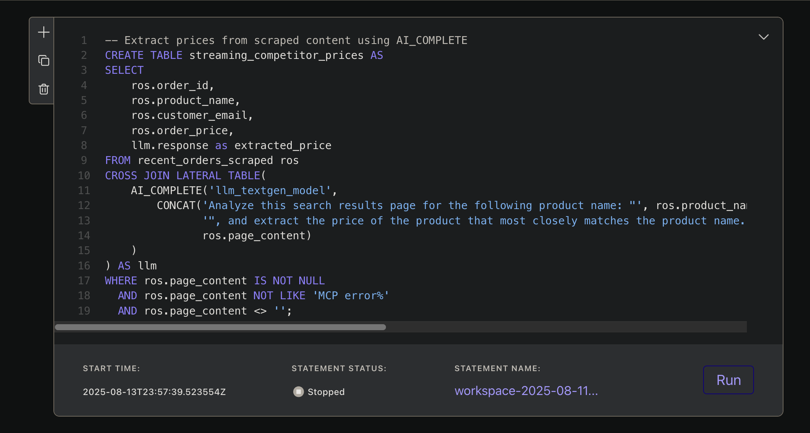
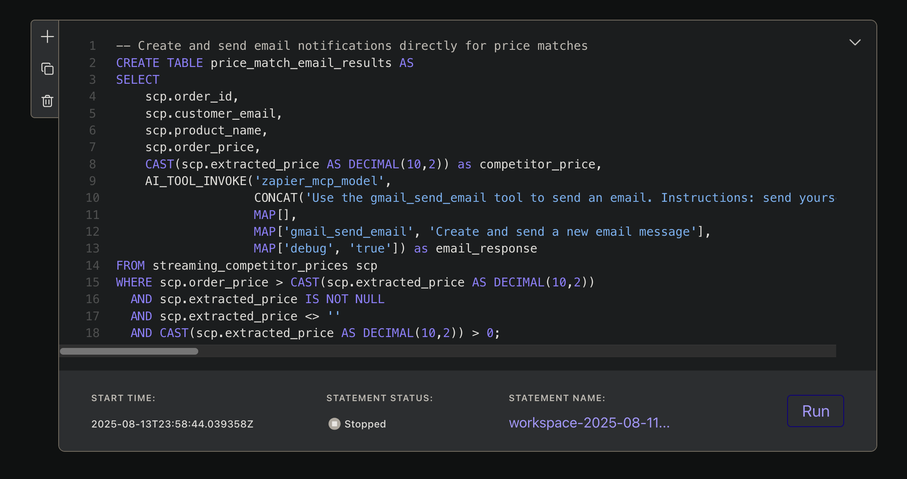

## Lab 1: Price Matching using Tool calling 

In this lab, we’ll use Confluent Cloud’s Apache Flink tool-calling feature to look up products in real-time orders. The LLM, through tool calling, uses a Zapier MCP server to retrieve competitor prices, and if a competitor offers a better price, the agent automatically applies a price match.


### Connecting to Flink

Confluent Cloud Flink Compute Pool is a managed environment that provides the resources needed to run Apache Flink jobs directly within Confluent Cloud. It eliminates the need for self-managed Flink clusters by offering a scalable, serverless compute layer for stream processing and real-time analytics on data in Confluent topics.

In [Flink UI](https://confluent.cloud/go/flink), choose the Environment. 

You will see a compute pool created for you. Click on **Open SQL Workspace**


### Agent 1: URL Scraping Agent

First, we need to enrich incoming Orders with product names, then search for and scrape these products from competitors’ websites. We’ll achieve this using Flink’s Tool Calling feature, which will enable Flink to invoke the Zapier MCP server we previously created.


In the Flink workspace, register the model and bind the tool to it in the Confluent catalog:

> **Note:**  
> If you changed the `prefix`, retrieve the updated query from `mcp_commands.txt` in the Terraform directory.  
> The example below uses Azure OpenAI. If you are using Amazon Bedrock, use the corresponding query from `mcp_commands.txt`.


```sql
  CREATE MODEL `zapier_mcp_model`
  INPUT (prompt STRING)
  OUTPUT (response STRING)
  WITH (
    'provider' = 'azureopenai',
    'task' = 'text_generation',
    'azureopenai.connection' = 'streaming-agents-azure-openai-connection',
    'mcp.connection' = 'zapier-mcp-connection'
  );
```

Run this in Flink Workspace UI to start the first agent:

```sql
-- Get recent orders, scrape competitor website for same product
SET 'sql.state-ttl' = '1 HOURS';
CREATE TABLE recent_orders_scraped AS
SELECT
    o.order_id,
    p.product_name,
    c.customer_email,
    o.price as order_price,
    (AI_TOOL_INVOKE(
        'zapier_mcp_model', 
        CONCAT('Use the webhooks_by_zapier_get tool to extract page contents. Instructions: Extract the page contents from the following URL: https://www.walmart.com/search?q="', 
               p.product_name, '"'),
        MAP[],
        MAP['webhooks_by_zapier_get', 'Fire off a single GET request with optional querystrings.'],
        MAP['debug', 'true', 'on_error', 'continue']
    ))['webhooks_by_zapier_get']['response'] as page_content
FROM orders o
JOIN customers c ON o.customer_id = c.customer_id  
JOIN products p ON o.product_id = p.product_id;
```


This agent uses the `product_name` as an input to URL scraping tool. The output is the `page_content` of the same product on the competitior website.

### Agent 2: Price Extractor Agent

Agent 2 will take `recent_orders_scraped` topic as an input and extract the competitior price from the `page_content` field.


In Flink workspace, register the model for Agent 2 in Confluent catalog:

> **Note:**  
> If you changed the `prefix`, retrieve the updated query from `mcp_commands.txt` in the Terraform directory.  
> The example below uses Azure OpenAI. If you are using Amazon Bedrock, use the corresponding query from `mcp_commands.txt`.

```sql
  CREATE MODEL `llm_textgen_model`
  INPUT (prompt STRING)
  OUTPUT (response STRING)
  WITH(
     'provider' = 'azureopenai',
     'task' = 'text_generation',
     'azureopenai.connection' = 'streaming-agents-azure-openai-connection'
  );
```

Start **Agent 2** to extract the competitor’s price from `page_content` and output it as a new field: `extracted_price`.

```sql
-- Extract prices from scraped webpages using AI_COMPLETE
CREATE TABLE streaming_competitor_prices AS
SELECT
    ros.order_id,
    ros.product_name,
    ros.customer_email,
    ros.order_price,
    llm.response as extracted_price
FROM recent_orders_scraped ros
CROSS JOIN LATERAL TABLE(
    AI_COMPLETE('llm_textgen_model', 
        CONCAT('Analyze this search results page for the following product name: "', ros.product_name, 
               '", and extract the price of the product that most closely matches the product name. Return only the price in format: XX.XX. For example, return only: 29.95. Page content: ', 
               ros.page_content)
    )
) AS llm
WHERE ros.page_content IS NOT NULL 
  AND ros.page_content NOT LIKE 'MCP error%'
  AND ros.page_content <> '';
```




In a new cell, check the output of `streaming_competitor_prices`

```sql
SELECT * FROM streaming_competitor_prices;
```


Notice the new field `extracted_price`. This will be used by the next Agent.


### Agent 3: Price Match Notification Agent

In this step, we’ll notify the customer when a price match has been applied.  
We’ll again use Confluent Cloud’s tool-calling feature — this time connecting to the Zapier MCP server to trigger an email or message to the customer.


We don’t need to register a new model here. Instead, we’ll reuse the one from Agent 1, since both agents use the same Zapier MCP server and share the same tools.  For this agent, the tool is `gmail_send_email`.

Start Agent 3 by running:

```sql
-- Create and send email notifications for price matches
CREATE TABLE price_match_email_results AS
SELECT 
    scp.order_id,
    scp.customer_email,
    scp.product_name,
    scp.order_price,
    CAST(scp.extracted_price AS DECIMAL(10,2)) as competitor_price,
    AI_TOOL_INVOKE('zapier_mcp_model', 
                   CONCAT('Use the gmail_send_email tool to send an email. Instructions: send yourself an email to your own email address, subject "Price match alert: Order #', scp.order_id, '", body "Original sale price: $', CAST(scp.order_price AS STRING), '. Price matched price: $', scp.extracted_price, '. Customer email address on file: ', scp.customer_email, '. Simulated customer notification: We have processed a price match refund for your ', scp.product_name, ' purchase."'), 
                   MAP[], 
                   MAP['gmail_send_email', 'Create and send a new email message'],
                   MAP['debug', 'true']) as email_response 
FROM streaming_competitor_prices scp
WHERE scp.order_price > CAST(scp.extracted_price AS DECIMAL(10,2))
  AND scp.extracted_price IS NOT NULL
  AND scp.extracted_price <> ''
  AND CAST(scp.extracted_price AS DECIMAL(10,2)) > 0;
```



With Agent 3 running, our real-time price matching pipeline is complete—orders stream in, competitor prices are fetched and analyzed, and customers are instantly notified when they get the best deal.  

Checkout your email for price matched orders


## Conclusion

By chaining these agents together, we’ve built a realtime datapipeline that reacts to market changes in seconds, ensures pricing competitiveness, and delivers immediate value to customers—right in their inbox.

## Topics

**Next topic:** [Clean-up](../README.md#-cleanup)

**Previous topic:** [Demo Introduction and Setup](../README.md)