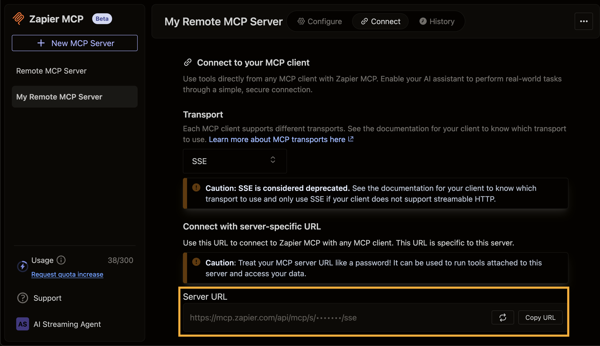
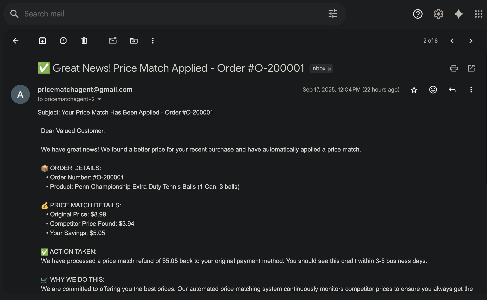

# Lab1: Tool Calling Agent Walkthrough

In this lab, we'll use Apache Flink for Confluent Cloud's MCP tool calling feature to "price match" customer orders in real-time. Flink, through tool calling, uses a remote MCP server to retrieve competitor prices, and if a competitor offers a better price, the agent automatically applies a price match and uses tool calling again to email the customer a summary.


## Prerequisites
- Run `uv run deploy` to deploy Lab1 (see [main README](./README.md))
- Zapier account and remote MCP server set up  (instructions below)
- ⚠️ **IMPORTANT: AWS Users Only:** To access Claude Sonnet 3.7 you must request access to the model by filling out an Anthropic use case form (or someone in your org must have previously done so) for your cloud region. To do so, visit the [Model Catalog](https://console.aws.amazon.com/bedrock/home#/model-catalog), select Claude 3.7 Sonnet and open it it in the Playground, then send a message in the chat - the form will appear automatically. ⚠️

## Zapier Remote MCP Server Setup

<details>
<summary>Zapier MCP Server Setup (Click to expand)</summary>

Create a Zapier MCP server for tool calling:

### 1. Create free Zapier Account

Sign up at [zapier.com](https://zapier.com/sign-up) and verify your email.

### 2. Create MCP Server

Visit [mcp.zapier.com](https://mcp.zapier.com/mcp/servers), choose "Other" as MCP Client, and create your server.

<details open>
<summary>Click to collapse</summary>


</details>

### 3. Add Tools

Add these tools to your MCP server:

- **Webhooks by Zapier: GET** and **Custom Request** tools
- **Gmail: Send Email** tool (authenticate via SSO)

<details open>
<summary>Click to collapse</summary>


</details>

### 4. Get SSE Endpoint URL

Click **"Connect",** choose **"Other"** for your client, then change transport to **"SSE Endpoint"**, and **copy the URL.** This is the `zapier_sse_endpoint` you will need to enter when deploying the lab with `uv run deploy`.

<details open>
<summary>Click to collapse</summary>



</details>

</details>

## Test the LLM models before continuing

Once you've deployed Lab1 via `uv run deploy`, run the following queries in the SQL Workspace to make sure your models are working as expected:

#### Test Query 1: Base LLM model

```sql
SELECT
  question,
  response
FROM (SELECT 'How was the state of Colorado founded?' as question) t,
LATERAL TABLE(ML_PREDICT('llm_textgen_model', question, MAP['debug', 'true'])) as r(response);
```

#### Test Query 2: LLM Tool Calling Model

⚠️ IMPORTANT: Replace `<<⚠️️YOUR-EMAIL-ADDRESS-HERE⚠️️>>` in the query below with the email address where you want the email to delivered to. ⚠️️️

```sql
 SELECT
      AI_TOOL_INVOKE(
          'zapier_mcp_model',
          'Use the gmail_send_email tool to send an email. 
           The "to" parameter must be a single string value: <<⚠️️YOUR-EMAIL-ADDRESS-HERE⚠️️>>
           The "subject" parameter is: Direct Query Test
           The "body" parameter is: This email was sent directly from Confluent Cloud!
           Important: pass the to address as a string, not an array.',
          MAP[],
          MAP['gmail_send_email', 'Create and send a new email message'],
          MAP['debug', 'true']
      ) as response;
```

## Generate Data

Make sure Docker is running, then begin generating data with the following command:

```bash
uv run lab1_datagen
```

<details>
<summary>Alternative: Using Python directly</summary>

```bash
python scripts/lab1_datagen.py
```

The Python script provides the same automation as the uv version.

</details>

The data generator creates three typical ecommerce data streams:

- **`customers`**: 100 customer records with realistic names, emails, addresses, and state information
- **`products`**: 17 product records including electronics, games, sports equipment, and household items with prices ranging from $5-$365
- **`orders`**: Continuous stream of orders linking customers to products with timestamps

## SQL Queries

## Run  `CREATE TOOL` and `CREATE AGENT`

```sql
CREATE TOOL zapier
USING CONNECTION `zapier-mcp-connection`
WITH (
  'type' = 'mcp',
  'allowed_tools' = 'webhooks_by_zapier_get, gmail_send_email',
  'request_timeout' = '30'
);
```

```sql
CREATE AGENT price_match_agent
USING MODEL llm_textgen_model
USING PROMPT 'You are a price matching assistant that performs the following steps:

1. SCRAPE COMPETITOR PRICE: Use the webhooks_by_zapier_get tool to extract page contents from the competitor URL provided in the prompt. The URL will be in the format: https://www.walmart.com/search?q="PRODUCT_NAME"

2. EXTRACT PRICE: Analyze the scraped page content to find the product that most closely matches the product name. Extract only the price in format: XX.XX (for example: 29.95). If you cannot find a valid price, stop here.

3. COMPARE AND NOTIFY: Compare the extracted competitor price with our order price. If the competitor price is lower than our price, use the gmail_send_email tool to send a price match notification email. Use the exact format provided in the prompt for the email subject and body.

Return a summary of actions taken and results.'
USING TOOLS zapier
COMMENT 'Consolidated agent for scraping competitor prices and sending price match notifications'
WITH (
  'max_consecutive_failures' = '2',
  'MAX_ITERATIONS' = '5'
);
```

## Create `price_match_input` table for the agent to use

In this step, we'll notify the customer when a price match has been applied.
We'll again use Confluent Cloud's tool-calling feature — this time connecting to the Zapier MCP server to trigger an email or message to the customer. For this agent, the tool is `gmail_send_email`.

⚠️ IMPORTANT: Replace `<<YOUR-EMAIL-ADDRESS-HERE>>` in the query below with the email address where you want the email to delivered to. ⚠️️️
```sql
SET 'sql.state-ttl' = '1 HOURS';
CREATE TABLE price_match_input AS
SELECT
    o.order_id,
    p.product_name,
    c.customer_email,
    o.price as order_price,
    CONCAT(
        'COMPETITOR URL: https://www.walmart.com/search?q="', p.product_name, '"',
        '\n\nPRODUCT NAME: ', p.product_name,
        '\n\nOUR ORDER PRICE: $', CAST(CAST(o.price AS DECIMAL(10, 2)) AS STRING),
        '\n\nEMAIL RECIPIENT: <<YOUR-EMAIL-ADDRESS-HERE>>',
        '\n\nEMAIL SUBJECT: ✅ Great News! Price Match Applied - Order #', o.order_id,
        '\n\nEMAIL BODY TEMPLATE:',
        '\nSubject: Your Price Match Has Been Applied - Order #', o.order_id, '

Dear Valued Customer,

We have great news! We found a better price for your recent purchase and have automatically applied a price match.

📦 ORDER DETAILS:
   • Order Number: #', o.order_id, '
   • Product: ', p.product_name, '

💰 PRICE MATCH DETAILS:
   • Original Price: $', CAST(CAST(o.price AS DECIMAL(10, 2)) AS STRING), '
   • Competitor Price Found: $[INSERT_COMPETITOR_PRICE]
   • Your Savings: $[INSERT_SAVINGS]

✅ ACTION TAKEN:
We have processed a price match refund of $[INSERT_SAVINGS] back to your original payment method. You should see this credit within 3-5 business days.

🛒 WHY WE DO THIS:
We are committed to offering you the best prices. Our automated price matching system continuously monitors competitor prices to ensure you always get the best deal.

Thank you for choosing River Retail. We appreciate your business!

Best regards,
River Retail Customer Success Team
📧 support@riverretail.com | 📞 1-800-RIVER-HELP

---
This is an automated message from our price matching system.'
    ) as agent_prompt
FROM orders o
JOIN customers c ON o.customer_id = c.customer_id
JOIN products p ON o.product_id = p.product_id;
```

## Run the Agent


```sql
CREATE TABLE price_match_results AS
SELECT
    pmi.order_id,
    pmi.product_name,
    pmi.customer_email,
    CAST(CAST(pmi.order_price AS DECIMAL(10, 2)) AS STRING) as order_price,
    agent_result.status as agent_status,
    agent_result.response as agent_response
FROM price_match_input pmi,
LATERAL TABLE(
    AI_RUN_AGENT(
        'price_match_agent',
        pmi.agent_prompt,
        pmi.order_id,
        MAP['debug', 'true']
    )
) as agent_result(status, response);
```

In a new cell, check the output of `price_match_results`.

###


With Agent 3 running, our real-time price matching pipeline is complete—orders stream in, competitor prices are fetched and analyzed, and customers are instantly notified when they get the best deal.

Check out your email for price matched orders:

<details open>
<summary>Click to collapse</summary>



</details>


## Verification Queries

```sql
-- Check pipeline progress
SELECT 
    'Orders Scraped' as step,
    COUNT(*) as record_count
FROM recent_orders_scraped
WHERE page_content IS NOT NULL

UNION ALL

SELECT 
    'Prices Extracted' as step,
    COUNT(*) as record_count
FROM streaming_competitor_prices
WHERE extracted_price IS NOT NULL

UNION ALL

SELECT 
    'Emails Sent' as step,
    COUNT(*) as record_count
FROM price_match_email_results
WHERE email_response IS NOT NULL;
```

```sql
-- View successful price matches
SELECT 
    order_id,
    product_name,
    order_price,
    competitor_price,
    (CAST(order_price AS DECIMAL(10,2)) - CAST(competitor_price AS DECIMAL(10,2))) as savings
FROM price_match_email_results;
```


## Conclusion

By chaining these agents together, we've built a real-time data pipeline that reacts to market changes in seconds, ensures pricing competitiveness, and delivers immediate value to customers—right in their inbox.

## Navigation

- **← Back to Overview**: [Main README](./README.md)
- **→ Next Lab**: [Lab2: Vector Search / RAG](./LAB2-Walkthrough.md)
- **Cleanup**: [Cleanup Instructions](./README.md#cleanup)
