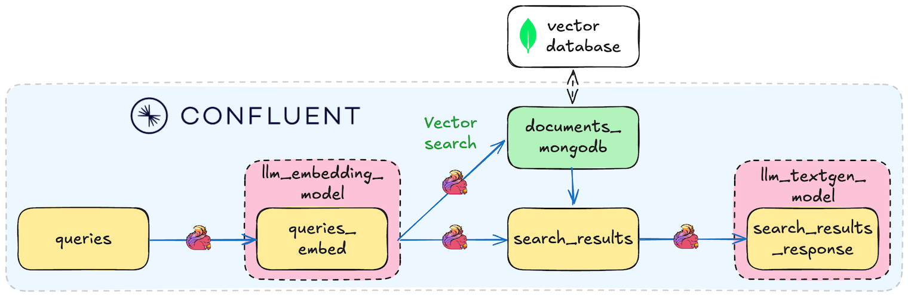

# Lab2: Vector Search / RAG Walkthrough

In this lab, we'll create a Retrieval-Augmented Generation (RAG) pipeline using Confluent Cloud for Apache Flink's vector search capabilities. The pipeline processes documents, creates embeddings, and enables semantic search to power intelligent responses through retrieval of relevant context.



## Prerequisites
- MongoDB free account with Atlas cluster (M0 - Free Tier) with vector search enabled (instructions [here](./assets/pre-setup/MongoDB-Setup.md)).
- ⚠️ **IMPORTANT: AWS Users Only:** To access Claude Sonnet 3.7 you must request access to the model by filling out an Anthropic use case form (or someone in your org must have previously done so) for your cloud region. To do so, visit the **[Model Catalog](https://console.aws.amazon.com/bedrock/home#/model-catalog)**, select Claude 3.7 Sonnet and open it it in the Playground, then send a message in the chat - the form will appear automatically. ⚠️

## Deployment

Use the setup script and select "Lab2" when prompted to automatically deploy Lab2 infrastructure:

```bash
uv run deploy
```

<details>
<summary>Manual alternative: Direct Python execution</summary>

```bash no-parse
pip install . && python deploy.py
```

</details>

During deployment, you'll be prompted to provide 3 MongoDB variables:
- `mongodb_connection_string`: The connection URL from [Step 5](./assets/pre-setup/MongoDB-Setup.md#step-1-create-mongodb-atlas-account-and-cluster) of MongoDB setup (e.g., `mongodb+srv://cluster0.abc123.mongodb.net`)
- `mongodb_username`: The database-specific username you created in [Step 4](./assets/pre-setup/MongoDB-Setup.md#step-1-create-mongodb-atlas-account-and-cluster) (*different* from what you use to login to MongoDB)
- `mongodb_password`: The database-specific password you created in [Step 4](./assets/pre-setup/MongoDB-Setup.md#step-1-create-mongodb-atlas-account-and-cluster)

Successful deployment creates the complete RAG pipeline:
- **6 Flink tables** for the document-to-response flow (intentionally in alphabetical order from beginning to end of pipeline, to keep things tidy!):
  - `documents` 
  - `documents_embed`
  - `documents_vectordb` 
  - `queries`
  - `queries_embed`
  - `search_results`
  - `search_results_response`

- **LLM models** for embeddings and text generation: `llm_textgen_model` and `llm_embedding_model`
- **MongoDB sink connector** to stream embeddings from `documents_embed` to Atlas

## Using the RAG Pipeline

### Load Confluent Flink Documentation

The lab uses real Confluent Flink documentation as the knowledge base:

```bash
# Load 385 documents into the pipeline (run from anywhere in repo)
uv run publish_docs --lab2
```

<details>
<summary>Alternative: Using Python directly</summary>

```bash no-parse
python scripts/lab2_publish_docs.py
```

</details>

This publishes pre-chunked Flink documentation that gets:
1. **Embedded** using the LLM embedding model
2. **Stored** in MongoDB Atlas with vector search index
3. **Made searchable** for semantic queries

### Query the RAG System

```bash
# Publish queries (run from anywhere in repo)
uv run publish_queries # starts interactive mode (recommended), or:
uv run publish_queries "How do I use window functions in Flink?"
```

<details>
<summary>Alternative: Using Python directly</summary>

```bash no-parse
python scripts/lab2_publish_queries.py # starts interactive mode, or:
python scripts/lab2_publish_queries.py "How do I use window functions in Flink?"
```

</details>

The vector search results can be found in the `search_results` table, and the RAG (retrieval-augmented generation) results can be found in the  `search_results_response` table. They contain:

- Source document snippets with similarity scores comparing query to document text
- Citations from the knowledge base
- AI-generated response based on retrieved docs (`search_results_response` only)

### View Results in Confluent Cloud

Monitor the pipeline in Confluent Cloud SQL workspace:

```sql
-- Check data flow through pipeline
SELECT
  (SELECT COUNT(*) FROM documents) AS document_count,                                 -- 385 Flink docs
  (SELECT COUNT(*) FROM documents_embed) AS document_embeddings_count,                -- 385 Flink docs in vector form
  (SELECT COUNT(*) FROM queries) AS queries_count,                                    -- Your questions
  (SELECT COUNT(*) FROM queries_embed) AS queries_embed_count,                        -- Your questions in vector form
  (SELECT COUNT(*) FROM search_results) AS search_results_count,                      -- Vector search results
  (SELECT COUNT(*) FROM search_results_response) AS search_results_response_count;    -- RAG based on vector search results

-- See vector search results
SELECT * FROM search_results LIMIT 5;

-- View final RAG responses
SELECT query, response FROM search_results_response LIMIT 5;
```

## Troubleshooting

<details>
<summary>Click to expand</summary>

### Script Issues
```bash no-parse
# If publish_docs.py fails
✗ Missing required dependencies!
→ Run: pip install .

✗ Terraform state not found!
→ Ensure you ran terraform apply successfully
```

### MongoDB Issues
- **Connection failed**: Verify IP allowlist includes `0.0.0.0/0`
- **Connection failed**: Ensure the following values are properly set:
  - Database name: `vector_search`
  - Collection name: `documents`
  - Vector search index name: `vector_index`
- **No vector search**: Confirm Atlas vector search index `vector_index` is active. Check that the type of search index is in fact an "Atlas **Vector** Search index" and not just an "Atlas Search index." Check that the JSON configuration matches the config in [step 9](./assets/pre-setup/MongoDB-Setup.md#9-scroll-down-to-the-bottom-and-choose-json-editor-enter-the-following).
- **Wrong credentials**: Use *database* username and password (not the credentials you use to login to MongoDB.com).

### Common Fixes
1. **Pipeline not processing**: Wait 30-60 seconds after publishing documents
2. **No query responses**: Check that LLM models are deployed in core infrastructure. [Run test query #1 found here](./LAB1-Walkthrough.md#test-query-1-base-llm-model) to ensure the `llm_textgen_model` is working properly.
3. **Empty results**: Verify MongoDB sink connector status in Confluent Cloud

</details>

## Navigation

- **← Back to Overview**: [Main README](./README.md)
- **← Previous Lab**: [Lab1: Tool Calling Agent](./LAB1-Walkthrough.md)
- **→ Next Lab**: [Lab3: Agentic Fleet Management](./LAB3-Walkthrough.md)
- **🧹 Cleanup**: [Cleanup Instructions](./README.md#cleanup)
