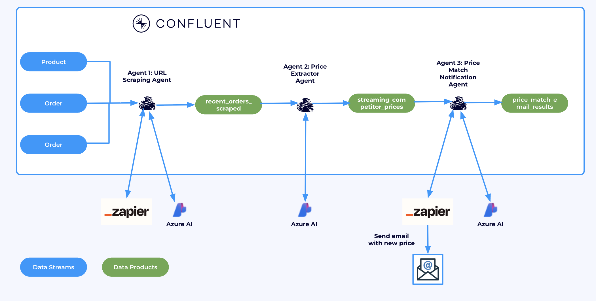

# Lab 2: RAG Pipeline Using Vector Search

In this lab, we'll create a Retrieval-Augmented Generation (RAG) pipeline using Confluent Cloud's Apache Flink vector search capabilities. The pipeline processes documents, creates embeddings, and enables semantic search to power intelligent responses through retrieval of relevant context.



## Architecture Overview

This lab implements a complete RAG pipeline with the following components:

1. **Document Ingestion**: Raw documents are ingested into a Kafka topic
2. **Text Chunking & Embedding**: Documents are split into chunks and converted to vector embeddings
3. **Vector Storage**: Embeddings are stored in MongoDB for efficient similarity search
4. **Query Processing**: User queries are embedded and used for vector search
5. **Response Generation**: Retrieved context is used to generate intelligent responses

## Prerequisites

- Core Terraform infrastructure deployed (from `/terraform/core/`)
- MongoDB Atlas cluster (Free Tier supported) with vector search enabled
- Either AWS or Azure cloud provider configured

## MongoDB Atlas Setup

### Required Credentials

You'll need the following credentials from MongoDB Atlas:

#### 1. Organization API Keys
**Location**: Organization Settings → Access Manager → API Keys
- **Public Key**: Organization-level API public key
- **Private Key**: Organization-level API private key
- **Permissions**: "Organization Project Creator" or "Organization Owner"

#### 2. Project Information
**Location**: Project Settings → General
- **Project ID**: 24-character hexadecimal string (e.g., `507f1f77bcf86cd799439011`)

#### 3. Database User Credentials
**Location**: Database Access → Database Users → Add New Database User
- **Username**: Project-specific database username (e.g., `confluent-user`)
- **Password**: Project-specific database user password
- **Database User Privileges**: "Read and write to any database"

#### 4. Cluster Information
**Location**: Clusters → Your Cluster Name
- **Cluster Name**: Your MongoDB cluster name (e.g., `Cluster0` for free tier)
- **Connection String**: Standard connection string format
- **Cluster Hostname**: Extract from connection string (e.g., `cluster0.abc123.mongodb.net`)

#### 5. Network Access
**Location**: Network Access → IP Access List
- Configure to allow Confluent Cloud IPs (or `0.0.0.0/0` for development)

### Atlas CLI Commands (Optional)
```bash
# List organizations
atlas orgs list

# List projects in organization
atlas projects list

# List clusters in project
atlas clusters list

# Get cluster connection strings
atlas clusters connectionStrings describe <CLUSTER_NAME>
```

### Create Vector Search Index
**Location**: MongoDB Atlas UI → Your Cluster → Search Tab → Create Index

Use the JSON Editor with this configuration:
```json
{
  "fields": [
    {
      "type": "vector",
      "path": "embedding",
      "numDimensions": 1536,
      "similarity": "cosine"
    }
  ]
}
```
- **Database**: `vector_search` (or your chosen database name)
- **Collection**: `documents` (or your chosen collection name)
- **Index Name**: `vector_index` (or your chosen index name)

## Deployment

### Step 1: Configure Variables

Navigate to your chosen cloud provider directory:

```bash
# For AWS
cd terraform/aws/lab2-vector-search

# For Azure
cd terraform/azure/lab2-vector-search
```

Create or update `terraform.tfvars` with your MongoDB credentials:

```hcl
# MongoDB Connection Details
MONGODB_CONNECTION_STRING = "mongodb+srv://cluster0.abc123.mongodb.net/?retryWrites=true&w=majority"
MONGODB_DATABASE = "vector_search"
MONGODB_COLLECTION = "documents"
MONGODB_INDEX_NAME = "vector_index"

# MongoDB Authentication (Project-specific credentials)
mongodb_username = "confluent-user"
mongodb_password = "your-secure-password"
mongodb_host = "cluster0.abc123.mongodb.net"

# Cloud Region
cloud_region = "East US"  # For Azure
# cloud_region = "us-east-1"  # For AWS
```

### Step 2: Deploy Terraform Infrastructure

```bash
terraform init
terraform plan
terraform apply
```

This will create:
- ✅ Flink tables: `documents`, `documents_embed`, `queries`, `queries_embed`
- ✅ MongoDB sink connector to stream embeddings to MongoDB Atlas
- ✅ Setup commands file with manual steps

### Step 3: Create MongoDB Connection

After Terraform deployment, create the MongoDB connection using the Confluent CLI:

```bash
# Get the exact command from the generated mongodb_commands.txt file
confluent flink connection create mongodb-connection \
  --cloud AZURE \
  --region "East US" \
  --type mongodb \
  --endpoint "mongodb+srv://cluster0.abc123.mongodb.net/?retryWrites=true&w=majority" \
  --username confluent-user \
  --password your-secure-password \
  --environment env-123456
```

### Step 4: Create External Tables and Views

In the Confluent Cloud Flink SQL workspace, execute these commands:

#### 1. Populate Embedding Tables

```sql
-- Populate documents_embed table with chunked and embedded documents
INSERT INTO documents_embed
WITH chunked_texts AS (
  SELECT
    document_id,
    document_text,
    chunk
  FROM documents
  CROSS JOIN UNNEST(
    ML_CHARACTER_TEXT_SPLITTER(
      document_text, 200, 20, '###', false, false, true, 'START'
    )
  ) AS t(chunk)
)
SELECT
  document_id,
  chunk,
  embedding AS embedding
FROM chunked_texts,
LATERAL TABLE(
  ML_PREDICT('llm_embedding_model', chunk)
);

-- Populate queries_embed table with embedded queries
INSERT INTO queries_embed
SELECT
  query,
  embedding
FROM queries,
LATERAL TABLE(ML_PREDICT('llm_embedding_model', query));
```

#### 2. Create MongoDB Vector Store External Table

```sql
-- Create documents_vectordb table (MongoDB vector store external table)
CREATE TABLE documents_vectordb (
  document_id STRING,
  chunk STRING,
  embedding ARRAY<FLOAT>
) WITH (
  'connector' = 'mongodb',
  'mongodb.connection' = 'mongodb-connection',
  'mongodb.database' = 'vector_search',
  'mongodb.collection' = 'documents',
  'mongodb.index' = 'vector_index',
  'mongodb.embedding_column' = 'embedding',
  'mongodb.numCandidates' = '500'
);
```

#### 3. Create Vector Search Results Table

```sql
-- Create search_results table (vector search results)
CREATE TABLE search_results AS
SELECT
qe.query,
-- Transform the array with named fields to exclude embeddings
ARRAY[
    CAST(ROW(vs.search_results[1].document_id, vs.search_results[1].chunk) AS ROW<document_id STRING, chunk STRING>),
    CAST(ROW(vs.search_results[2].document_id, vs.search_results[2].chunk) AS ROW<document_id STRING, chunk STRING>),
    CAST(ROW(vs.search_results[3].document_id, vs.search_results[3].chunk) AS ROW<document_id STRING, chunk STRING>)
] AS results
FROM
queries_embed AS qe,
LATERAL TABLE(VECTOR_SEARCH(
    documents_vectordb,
    3,
    DESCRIPTOR(embedding),
    qe.embedding
)) AS vs;
```

#### 4. Create RAG Response Generation Table

```sql
-- Create search_results_response table (RAG responses)
CREATE TABLE search_results_response AS
SELECT
    qr.query,
    CAST(qr.results AS STRING) AS results_text,
    pred.response
FROM search_results qr,
LATERAL TABLE(
    ml_predict(
        'llm_textgen_model',
        CONCAT(
            'You are an expert assistant. Provide helpful answers based on the provided context.

            Question: ', qr.query,
            '\n\nContext:\n',
            'Document 1: ', qr.results[1].document_id, '\n',
            qr.results[1].chunk, '\n\n',
            'Document 2: ', qr.results[2].document_id, '\n',
            qr.results[2].chunk, '\n\n',
            'Document 3: ', qr.results[3].document_id, '\n',
            qr.results[3].chunk,
            '\n\nAnswer:'
        )
    )
) AS pred;
```

## Using the RAG Pipeline

### 1. Insert Sample Documents

```sql
INSERT INTO documents VALUES
('sales/pricing_guide.md', 'Our pricing model is flexible and designed to scale with your business. We offer three tiers: Starter at $99/month for up to 10 users, Professional at $299/month for up to 50 users, and Enterprise with custom pricing for larger organizations. All plans include 24/7 support and a 30-day money-back guarantee.'),
('support/troubleshooting.md', 'When experiencing connection issues, first check your internet connection. Then verify your credentials are correct. If problems persist, restart the application and check for updates. Contact support if issues continue.'),
('product/features.md', 'Our platform includes advanced analytics, real-time collaboration, automated workflows, and enterprise-grade security. The analytics dashboard provides comprehensive insights into user behavior and system performance.');
```

### 2. Submit Queries

```sql
INSERT INTO queries VALUES
('What are your pricing options?'),
('How do I troubleshoot connection problems?'),
('What features does the platform include?');
```

### 3. View Results

```sql
-- See search results with relevant document chunks
SELECT * FROM search_results;

-- See AI-generated responses based on retrieved context
SELECT query, response FROM search_results_response;
```

## Verification and Monitoring

### Check MongoDB Sink Connector Status
```bash
confluent connector list
confluent connector describe <connector-id>
```

### Monitor Data Flow
```sql
-- Check if documents are being processed
SELECT COUNT(*) FROM documents;
SELECT COUNT(*) FROM documents_embed;

-- Check if queries are being processed
SELECT COUNT(*) FROM queries;
SELECT COUNT(*) FROM queries_embed;

-- Verify MongoDB external table connectivity
SELECT COUNT(*) FROM documents_vectordb;
```

### View MongoDB Data
In MongoDB Atlas or MongoDB Compass:
```javascript
// Check if data is being written to MongoDB
db.documents.find().limit(5);
db.documents.countDocuments();
```

## Tables Created

- **documents**: Raw document input table (Kafka topic)
- **documents_embed**: Documents with chunked text and embeddings (Kafka topic)
- **queries**: User query input table (Kafka topic)
- **queries_embed**: Queries with embeddings (Kafka topic)
- **documents_vectordb**: MongoDB vector store external table
- **search_results**: Vector search results view
- **search_results_response**: Generated RAG responses view

## Architecture Benefits

- **Real-time Processing**: Stream processing enables immediate document indexing and query responses
- **Scalable Vector Search**: MongoDB Atlas provides enterprise-grade vector search capabilities
- **Contextual Responses**: RAG combines retrieval with generation for accurate, relevant answers
- **Cloud Native**: Fully managed services eliminate infrastructure overhead
- **Cost Effective**: Works with MongoDB Free Tier for development and testing

## Troubleshooting

### Common Issues

1. **MongoDB Connection Failed**
   - Verify IP allowlist includes Confluent Cloud IPs
   - Check username/password are project-specific (not organization-level)
   - Ensure connection string format is correct

2. **Vector Search Not Working**
   - Confirm vector search index is created and active
   - Verify index configuration matches embedding dimensions (1536 for OpenAI)
   - Check that embeddings are being written to MongoDB collection

3. **Flink SQL Errors**
   - Ensure all required models are deployed (`llm_embedding_model`, `llm_textgen_model`)
   - Verify compute pool has sufficient resources
   - Check table schemas match expected formats

4. **No Data in MongoDB**
   - Verify MongoDB sink connector is running
   - Check connector logs for errors
   - Ensure documents_embed table has data

### Getting Help

- Check Terraform outputs for connection details
- Review generated `mongodb_commands.txt` for setup steps
- Use Confluent Cloud monitoring to track data flow
- Check MongoDB Atlas metrics for storage and query performance

## Next Steps

- Experiment with different chunk sizes and overlap parameters
- Tune vector search parameters (`mongodb.numCandidates`) for your use case
- Integrate with front-end applications via Kafka consumers
- Add document metadata for enhanced filtering and search
- Scale to production with larger compute pools and MongoDB clusters

## Cleanup

To tear down the lab infrastructure:

```bash
terraform destroy
```

This will remove all Confluent Cloud resources but preserve your MongoDB Atlas cluster.

**Previous topic:** [Lab 1 - Tool Calling](LAB1.md)

**Next topic:** [Clean-up](README.md#-cleanup)