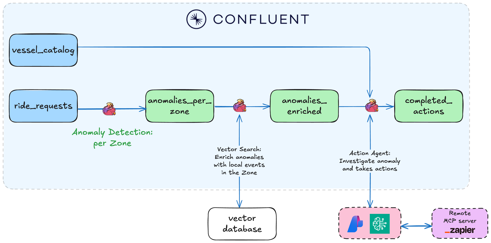
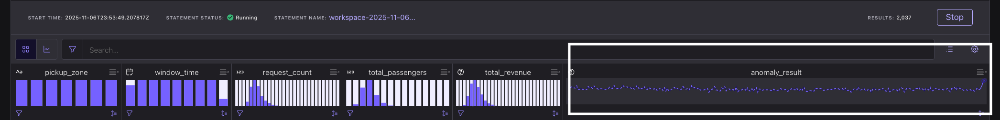
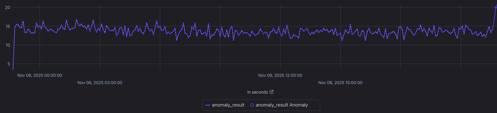
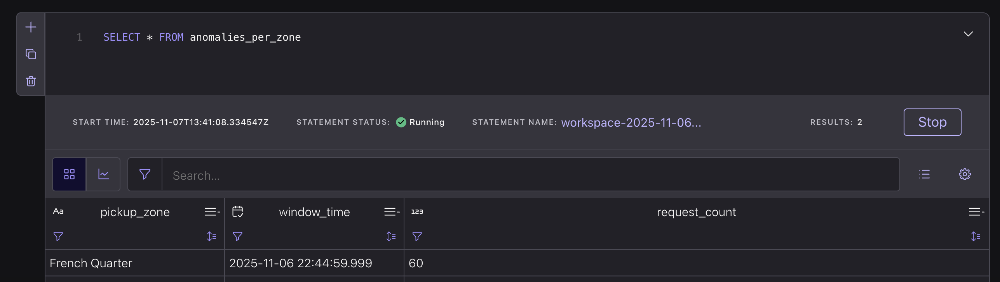
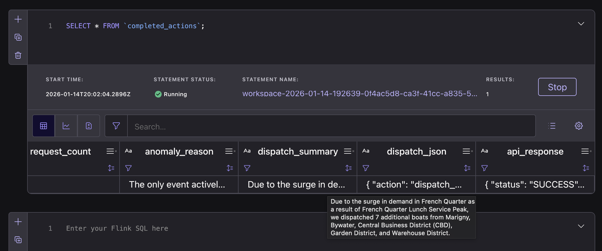

# Lab3: Agentic Fleet Management Using Confluent Intelligence


This demo showcases an intelligent, real-time fleet management system that autonomously detects demand surges, identifies their causes using AI-powered reasoning, and automatically dispatches vessels to meet increased demand. Built on [Confluent Intelligence](https://www.confluent.io/product/confluent-intelligence/), the system combines stream processing, anomaly detection, retrieval-augmented generation (RAG), and AI agent workflows to create a fully autonomous operations pipeline.
### What This System Does

The system continuously monitors ride request streams in real time and performs three key automated operations:

1. **Anomaly Detection** – Detects unusual spikes in ride requests across different zones using Flink’s [built-in ML functions](https://docs.confluent.io/cloud/current/ai/builtin-functions/overview.html).  
2. **Contextual Understanding** – Leverages [vector search](https://docs.confluent.io/cloud/current/ai/external-tables/vector-search.html) and RAG to uncover the reasons behind demand surges (e.g., events, conferences, festivals) by querying a knowledge base.  
3. **Autonomous Action** – Automatically dispatches docked vessels or repositions available ones to high-demand zones using [Streaming Agents](https://docs.confluent.io/cloud/current/ai/streaming-agents/overview.html) with tool calling.  

All of this runs in real time on **Confluent Cloud for Apache Flink**, with no external orchestration required.




## Prerequisites
<details>
<summary> Install prerequisites (Mac/Windows)</summary>
**Mac:**

```bash
brew install uv git python docker colima && brew tap hashicorp/tap && brew install hashicorp/tap/terraform && brew install --cask confluent-cli
```

**Windows:**
```powershell
winget install astral-sh.uv Git.Git Hashicorp.Terraform ConfluentInc.Confluent-CLI Python.Python SUSE.RancherDesktop.Main
```
</details>

- Zapier remote MCP server ([Setup guide](./assets/pre-setup/Zapier-Setup.md)) - this will be provided during the workshop.
- MongoDB Atlas vector database ([Setup guide](./assets/pre-setup/MongoDB-Setup.md)) - will be provided during the workshop.

## Deploy the Demo

Once you have these credentials ready, run the following command and choose **Lab3** (see [main README](./README.md)):

  ```sql no-parse
  uv run deploy --workshop
  ```
## Usecase Walkthrough

### 0. Data Generation

We use ShadowTraffic to generate data, which requires Docker and a Docker orchestrator to run. For Windows, open **Rancher Desktop**, and for Mac, run the following command:

```bash
# Run the following command for Mac. Windows users, open Rancher Desktop app.
colima start
```
Then run:
```bash
uv run lab3_datagen
```

The data generator produces the following data stream:

- **`ride_requests`** – Represents incoming boat ride requests. Each request includes a **pickup zone**  **drop-off zone**, **timestamp**, and other user info like the ride ID and price.


### 1. Anomaly Detection: Detect surge in `ride_requests` using `ML_DETECT_ANOMALIES`

This step identifies unexpected surges in ride requests for each pickup zone in real time using Flink's built-in anomaly detection function. We analyze ride request counts over 5-minute windows and compare them against expected baselines derived from historical trends.

Read the [blog post](https://docs.confluent.io/cloud/current/ai/builtin-functions/detect-anomalies.html) and view the [documentation](https://docs.confluent.io/cloud/current/flink/reference/functions/model-inference-functions.html#flink-sql-ml-anomaly-detect-function) on Flink anomaly detection for more details about how it works.

In [Flink UI](https://confluen.cloud/go/flink), select your environment and open a SQL workspace.

First, let's visualize the anomaly detection in action by running this query:

```sql
WITH windowed_traffic AS (
    SELECT
        window_start,
        window_end,
        window_time,
        pickup_zone,
        COUNT(*) AS request_count,
        SUM(number_of_passengers) AS total_passengers,
        SUM(CAST(price AS DECIMAL(10, 2))) AS total_revenue
    FROM TABLE(
        TUMBLE(TABLE ride_requests, DESCRIPTOR(request_ts), INTERVAL '5' MINUTE)
    )
    GROUP BY window_start, window_end, window_time, pickup_zone
)
SELECT
    pickup_zone,
    window_time,
    request_count,
    total_passengers,
    total_revenue,
    ML_DETECT_ANOMALIES(
        CAST(request_count AS DOUBLE),
        window_time,
        JSON_OBJECT(
            'minTrainingSize' VALUE 287,
            'maxTrainingSize' VALUE 7000,
            'confidencePercentage' VALUE 99.999,
            'enableStl' VALUE FALSE
        )
    ) OVER (
        PARTITION BY pickup_zone
        ORDER BY window_time
        RANGE BETWEEN UNBOUNDED PRECEDING AND CURRENT ROW
    ) AS anomaly_result
FROM windowed_traffic;
```

Click on the **anomaly_result** graph.



You will notice that there was an anomaly detected in one of the zones.



Now let's turn this into a continuous Flink job that filters for only the anomalies:

```sql
CREATE TABLE anomalies_per_zone AS
WITH windowed_traffic AS (
    SELECT
        window_start,
        window_end,
        window_time,
        pickup_zone,
        COUNT(*) AS request_count,
        SUM(number_of_passengers) AS total_passengers,
        SUM(CAST(price AS DECIMAL(10, 2))) AS total_revenue
    FROM TABLE(
        TUMBLE(TABLE ride_requests, DESCRIPTOR(request_ts), INTERVAL '5' MINUTE)
    )
    GROUP BY window_start, window_end, window_time, pickup_zone
),
anomaly_detection AS (
    SELECT
        pickup_zone,
        window_time,
        request_count,
        total_passengers,
        total_revenue,
        ML_DETECT_ANOMALIES(
            CAST(request_count AS DOUBLE),
            window_time,
            JSON_OBJECT(
                'minTrainingSize' VALUE 287,
                'maxTrainingSize' VALUE 7000,
                'confidencePercentage' VALUE 99.999,
                'enableStl' VALUE FALSE
            )
        ) OVER (
            PARTITION BY pickup_zone
            ORDER BY window_time
            RANGE BETWEEN UNBOUNDED PRECEDING AND CURRENT ROW
        ) AS anomaly_result
    FROM windowed_traffic
)
SELECT
    pickup_zone,
    window_time,
    request_count,
    total_passengers,
    total_revenue,
    CAST(ROUND(anomaly_result.forecast_value) AS BIGINT) AS expected_requests,
    anomaly_result.upper_bound AS upper_bound,
    anomaly_result.lower_bound AS lower_bound,
    anomaly_result.is_anomaly AS is_surge
FROM anomaly_detection
WHERE anomaly_result.is_anomaly = true
  AND request_count > anomaly_result.upper_bound;
```

> [!NOTE]
>
> It will typically take around five minutes for Flink to detect an anomaly. The reason for this is that we're detecting anomalies in 5-minute "windows", and we need to wait for the first window to close before Flink can detect one.


> NOTE: Leave the query running so that it runs continously.

In a new cell, run the following to view the results.

```sql
SELECT * FROM anomalies_per_zone
```

You should see an anomaly in the `French Quarter` zone.



These detected surges are then used as triggers for the next steps — contextual understanding and agentic vessel movement.


### 2. Enrich `anomalies_per_zone` with possible causes of the anomaly using vector search

Once a surge is detected, we want to **understand why** it happened. This step enriches detected anomalies with real-world context using **Vector Search** and **LLM-based reasoning**. These detected surges are then used as triggers for the next steps — contextual understanding and agentic vessel movement.

The query takes each detected surge and formulates a natural language query describing the anomaly (e.g., *"Transportation demand surge in French Quarter zone at 8:00 PM…"*). It then embeds that query using an **LLM embedding model** and searches a **vector database** of local event data (e.g., concerts, conferences, or sports games) to find the most relevant documents.

Finally, it uses an **LLM text generation model** to summarize the results into a concise, human-readable explanation of the likely cause for the surge.

```sql
CREATE TABLE anomalies_enriched
WITH ('changelog.mode' = 'append')
AS SELECT
    pickup_zone,
    window_time,
    request_count,
    expected_requests,
    anomaly_reason,
    top_chunk_1,
    top_chunk_2,
    top_chunk_3
FROM (
    SELECT
        rad_with_rag.pickup_zone,
        rad_with_rag.window_time,
        rad_with_rag.request_count,
        rad_with_rag.expected_requests,
        rad_with_rag.is_surge,
        TRIM(llm_response.response) AS anomaly_reason,
        rad_with_rag.top_chunk_1,
        rad_with_rag.top_chunk_2,
        rad_with_rag.top_chunk_3
    FROM (
        SELECT
            rad.pickup_zone,
            rad.window_time,
            rad.request_count,
            rad.expected_requests,
            rad.is_surge,
            rad.query,
            vs.search_results[1].document_id AS top_document_1,
            vs.search_results[1].chunk AS top_chunk_1,
            vs.search_results[1].score AS top_score_1,
            vs.search_results[2].document_id AS top_document_2,
            vs.search_results[2].chunk AS top_chunk_2,
            vs.search_results[2].score AS top_score_2,
            vs.search_results[3].document_id AS top_document_3,
            vs.search_results[3].chunk AS top_chunk_3,
            vs.search_results[3].score AS top_score_3
        FROM (
            SELECT
                pickup_zone,
                window_time,
                request_count,
                expected_requests,
                is_surge,
                CONCAT(
                    'Transportation demand surge in ',
                    pickup_zone,
                    ' at ',
                    DATE_FORMAT(window_time, 'h:mm a'),
                    ' (',
                    DATE_FORMAT(window_time, 'HH:mm'),
                    ') during ',
                    CASE
                        WHEN HOUR(window_time) >= 0 AND HOUR(window_time) < 4 THEN 'late night hours (12:00 AM - 4:00 AM)'
                        WHEN HOUR(window_time) >= 4 AND HOUR(window_time) < 7 THEN 'early morning setup period (4:00 AM - 7:00 AM)'
                        WHEN HOUR(window_time) >= 7 AND HOUR(window_time) < 9 THEN 'morning rush hours (7:00 AM - 9:00 AM)'
                        WHEN HOUR(window_time) >= 9 AND HOUR(window_time) < 12 THEN 'late morning period (9:00 AM - 12:00 PM)'
                        WHEN HOUR(window_time) >= 12 AND HOUR(window_time) < 14 THEN 'lunch service peak (12:00 PM - 2:00 PM)'
                        WHEN HOUR(window_time) >= 14 AND HOUR(window_time) < 17 THEN 'afternoon hours (2:00 PM - 5:00 PM)'
                        WHEN HOUR(window_time) >= 17 AND HOUR(window_time) < 20 THEN 'evening dinner period (5:00 PM - 8:00 PM)'
                        WHEN HOUR(window_time) >= 20 AND HOUR(window_time) < 23 THEN 'nightlife hours (8:00 PM - 11:00 PM)'
                        ELSE 'late night period (11:00 PM - 12:00 AM)'
                    END,
                    '. Looking for HIGH demand events occurring between ',
                    DATE_FORMAT(window_time - INTERVAL '1' HOUR, 'h:mm a'),
                    ' and ',
                    DATE_FORMAT(window_time + INTERVAL '1' HOUR, 'h:mm a'),
                    '. Expected: ',
                    CAST(expected_requests AS STRING),
                    ', Actual: ',
                    CAST(request_count AS STRING),
                    ' (+',
                    CAST(ROUND(((request_count - expected_requests) / expected_requests) * 100, 1) AS STRING),
                    '%). What HIGH impact events, festivals, or gatherings are active in ',
                    pickup_zone,
                    ' during this time?'
                ) AS query,
                emb.embedding
            FROM anomalies_per_zone,
            LATERAL TABLE(ML_PREDICT('llm_embedding_model',
                CONCAT(
                    'Transportation demand surge in ',
                    pickup_zone,
                    ' at ',
                    DATE_FORMAT(window_time, 'h:mm a'),
                    ' (',
                    DATE_FORMAT(window_time, 'HH:mm'),
                    ') during ',
                    CASE
                        WHEN HOUR(window_time) >= 0 AND HOUR(window_time) < 4 THEN 'late night hours (12:00 AM - 4:00 AM)'
                        WHEN HOUR(window_time) >= 4 AND HOUR(window_time) < 7 THEN 'early morning setup period (4:00 AM - 7:00 AM)'
                        WHEN HOUR(window_time) >= 7 AND HOUR(window_time) < 9 THEN 'morning rush hours (7:00 AM - 9:00 AM)'
                        WHEN HOUR(window_time) >= 9 AND HOUR(window_time) < 12 THEN 'late morning period (9:00 AM - 12:00 PM)'
                        WHEN HOUR(window_time) >= 12 AND HOUR(window_time) < 14 THEN 'lunch service peak (12:00 PM - 2:00 PM)'
                        WHEN HOUR(window_time) >= 14 AND HOUR(window_time) < 17 THEN 'afternoon hours (2:00 PM - 5:00 PM)'
                        WHEN HOUR(window_time) >= 17 AND HOUR(window_time) < 20 THEN 'evening dinner period (5:00 PM - 8:00 PM)'
                        WHEN HOUR(window_time) >= 20 AND HOUR(window_time) < 23 THEN 'nightlife hours (8:00 PM - 11:00 PM)'
                        ELSE 'late night period (11:00 PM - 12:00 AM)'
                    END,
                    '. Looking for HIGH demand events occurring between ',
                    DATE_FORMAT(window_time - INTERVAL '1' HOUR, 'h:mm a'),
                    ' and ',
                    DATE_FORMAT(window_time + INTERVAL '1' HOUR, 'h:mm a'),
                    '. Expected: ',
                    CAST(expected_requests AS STRING),
                    ', Actual: ',
                    CAST(request_count AS STRING),
                    ' (+',
                    CAST(ROUND(((request_count - expected_requests) / expected_requests) * 100, 1) AS STRING),
                    '%). What HIGH impact events, festivals, or gatherings are active in ',
                    pickup_zone,
                    ' during this time?'
                )
            )) AS emb
            WHERE is_surge = true
        ) AS rad,
        LATERAL TABLE(
            VECTOR_SEARCH_AGG(
                documents_vectordb_lab3,
                DESCRIPTOR(embedding),
                rad.embedding,
                3
            )
        ) AS vs
    ) AS rad_with_rag,
    LATERAL TABLE(
        ML_PREDICT(
            'llm_textgen_model',
            CONCAT(
                'Analyze the retrieved HIGH demand event documents and identify which events are actively occurring during the surge time. Only consider events whose time ranges overlap with the query time. Provide a one-two sentence explanation including specific event names, attendance numbers, and time ranges.\n\n',
                'USER QUERY: ', rad_with_rag.query, '\n\n',
                'RETRIEVED DOCUMENTS:\n',
                'Document 1 (Score: ', CAST(rad_with_rag.top_score_1 AS STRING), '):\n',
                'Source: ', rad_with_rag.top_document_1, '\n',
                rad_with_rag.top_chunk_1, '\n\n',
                'Document 2 (Score: ', CAST(rad_with_rag.top_score_2 AS STRING), '):\n',
                'Source: ', rad_with_rag.top_document_2, '\n',
                rad_with_rag.top_chunk_2, '\n\n',
                'Document 3 (Score: ', CAST(rad_with_rag.top_score_3 AS STRING), '):\n',
                'Source: ', rad_with_rag.top_document_3, '\n',
                rad_with_rag.top_chunk_3, '\n\n',
                'Provide only the reason, no additional text.'
            )
        )
    ) AS llm_response
);
```

> NOTE: Leave the query running so that it runs continously.

### 3. Agent Definition: Run `CREATE TOOL` and `CREATE AGENT` to define agent tools, prompt, and capabilities

Once anomalies have been detected and enriched with context, the system can act on them automatically using Streaming Agents. We can trigger specific operational workflows — for example, dispatching idle vessels from nearby docks to high-demand zones.

These agents leverage tool calling to interact directly with external systems or APIs, enabling closed-loop automation — all running natively within Confluent Cloud for Apache Flink.

See [CREATE TOOL documentation](https://docs.confluent.io/cloud/current/flink/reference/statements/create-tool.html).
```sql
CREATE TOOL zapier
USING CONNECTION `zapier-mcp-connection`
WITH (
  'type' = 'mcp',
  'allowed_tools' = 'webhooks_by_zapier_get, webhooks_by_zapier_custom_request, gmail_send_email',
  'request_timeout' = '30'
);
```

See [CREATE AGENT documentation](https://docs.confluent.io/cloud/current/flink/reference/statements/create-agent.html#flink-sql-create-agent).
```sql
CREATE AGENT `boat_dispatch_agent`
USING MODEL `zapier_mcp_model`
USING PROMPT 'You are an intelligent boat dispatch coordinator for a riverboat ride-sharing service.

Your workflow:
1. ANALYZE the surge information provided (zone, time, request count, anomaly reason)
2. REVIEW the available vessels list by sending a basic GET request using the webhooks_by_zapier_get tool to "https://p8jrtzaj78.execute-api.us-east-1.amazonaws.com/prod/api/vessel_catalog"
3. SELECT appropriate boats to dispatch based on:
   - Proximity to the target zone
   - Boat capacity
   - Current availability
   - Surge magnitude (dispatch up to 8 boats for large surges)
4. CREATE a JSON dispatch request with this exact structure:
   {
     "action": "dispatch_boats",
     "zone": "<target_zone>",
     "boats": [
       {
         "vessel_id": "<vessel_id>",
         "new_zone": "<target_zone>",
         "new_availability": "available"
       }
     ]
   }
5. USE the webhooks_by_zapier_custom_request tool to POST the dispatch request to:
   URL: https://p8jrtzaj78.execute-api.us-east-1.amazonaws.com/prod/api/dispatch
   Method: POST
   Headers: {"Content-Type": "application/json"}
   Data: <your generated JSON>

6. FORMAT your final response with these THREE sections:

Dispatch Summary:
Due to the surge in demand in [zone] as a result of [event], we dispatched [n] additional boats from [list of zones].

Dispatch JSON:
{your dispatch JSON here}

API Response:
{the response from the API call}

CRITICAL INSTRUCTIONS:
- Dispatch boats from nearby zones first
- Dispatch more boats with larger capacities for big surges (up to 8 boats)
- Your response MUST contain the three labeled sections
- The dispatch JSON must be valid and contain only the structure shown above
- Always execute the POST request and include the API response
- Do NOT include any other explanatory text outside these three sections'
USING TOOLS `zapier`
WITH (
  'max_iterations' = '10'
);
```
### 4. Invoke the agent with `AI_RUN_AGENT`

Start the agent with the `AI_RUN_AGENT` command to start taking action on any anomalies the moment that Flink detects them.See [AI_RUN_AGENT documentation](https://docs.confluent.io/cloud/current/flink/reference/functions/model-inference-functions.html#flink-sql-ai-run-agent-function).
```sql
CREATE TABLE completed_actions (
    PRIMARY KEY (pickup_zone) NOT ENFORCED
)
WITH ('changelog.mode' = 'append')
AS SELECT
    pickup_zone,
    window_time,
    request_count,
    anomaly_reason,
    TRIM(REGEXP_EXTRACT(CAST(response AS STRING), 'Dispatch Summary:\s*\n(.+?)(?=\n\nDispatch JSON:)', 1)) AS dispatch_summary,
    TRIM(REGEXP_EXTRACT(CAST(response AS STRING), 'Dispatch JSON:\s*\n(?:```json\s*)?([\s\S]+?)(?:```)?(?=\n\nAPI Response:)', 1)) AS dispatch_json,
    TRIM(REGEXP_EXTRACT(CAST(response AS STRING), 'API Response:\s*\n(?:```json\s*)?([\s\S]+?)(?:```)?$', 1)) AS api_response
FROM anomalies_enriched,
LATERAL TABLE(AI_RUN_AGENT(
    `boat_dispatch_agent`,
    `anomaly_reason`,
    `pickup_zone`
));
```

Then view the `dispatch_summary`, `dispatch_json`, and `api_response` summary of the streaming agent's output.
```sql
SELECT * FROM `completed_actions`;
```



### 5. Email challenge (Bonus)


Now, see if you can build a pipeline to create a Streaming Agent that sends you an email for each anomaly that's detected in the `anomalies_per_zone` topic. The `zapier` tool already gives your agent access to the `gmail_send_email` method. Create a new agent with the `CREATE AGENT` syntax, and you'll be well on your way!

## Conclusion

By chaining these intelligent streaming components together, we’ve built an always-on, real-time, context-aware agentic pipeline that detects ride request demand surges, explains their causes, and takes autonomous action — all within seconds.

## Troubleshooting
<details>
<summary>Click to expand</summary>

- **No anomalies detected?** Check that your data generation is running. The first anomaly should be detected after both data generation (run `uv run lab3_datagen`) and the anomaly detection query **(Query #1)** have been running for about 5 minutes. This is because the anomaly detection query uses 5-minute windows, and we have to wait for the first window to close before the detection algorithm can identify an anomaly.

- **Error when running Query #1?:** `The window function requires the timecol is a time attribute type, but is TIMESTAMP_WITH_LOCAL_TIME_ZONE(3).`
  - Run the query below and try again. This can occur if you drop the pre-created `ride_requests` table and then re-run data generation, because neither Flink nor the data generator know we want to use `request_ts` as our watermark column until we tell them.
```sql no-parse
ALTER TABLE ride_requests
MODIFY (WATERMARK FOR request_ts AS request_ts - INTERVAL '5' SECOND);
```
- **Email about a degraded Flink statement?**
  - Press "Stop" on the running `CREATE TABLE anomalies_detected_per_zone` statement in the SQL Workspace.
    - The anomaly detection algorithm expects data to be flowing through it, and the statement will change to "degraded" after some time if you turn off data generation. Turning it off will stop the problem, or it will automatically resume running properly once data begins flowing again.

- `Runtime received bad response code 403. Please also double check if your model has multiple versions.` error?
  - **AWS?** Ensure you've activated Claude 3.7 Sonnet in your AWS account. See: [Prerequisites](#prerequisites)
  - **Azure?** Increase the tokens per minute quota for your GPT-4 model. Quota is low by default.
  </details>

## 🧹 Clean-up

When you’re done with the lab, make sure to clean up your resources to avoid unnecessary costs and keep your environment tidy.

Run the following command:

```bash
uv run destroy
```
Choose **AWS** when prompted. This will remove all lab-related resources safely.


## Navigation

- **← Back to Overview**: [Main README](./README.md)
- **← Previous Lab**: [Lab2: Vector Search & RAG](./LAB2-Walkthrough.md)
- **🧹 Cleanup**: [Cleanup Instructions](./README.md#cleanup)