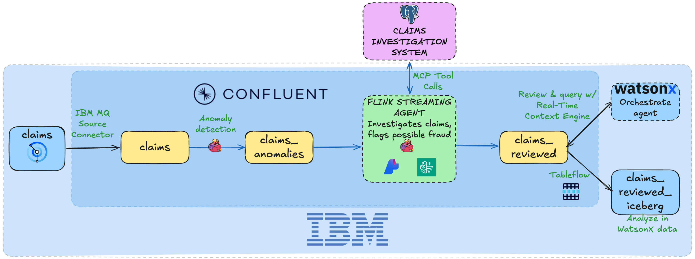
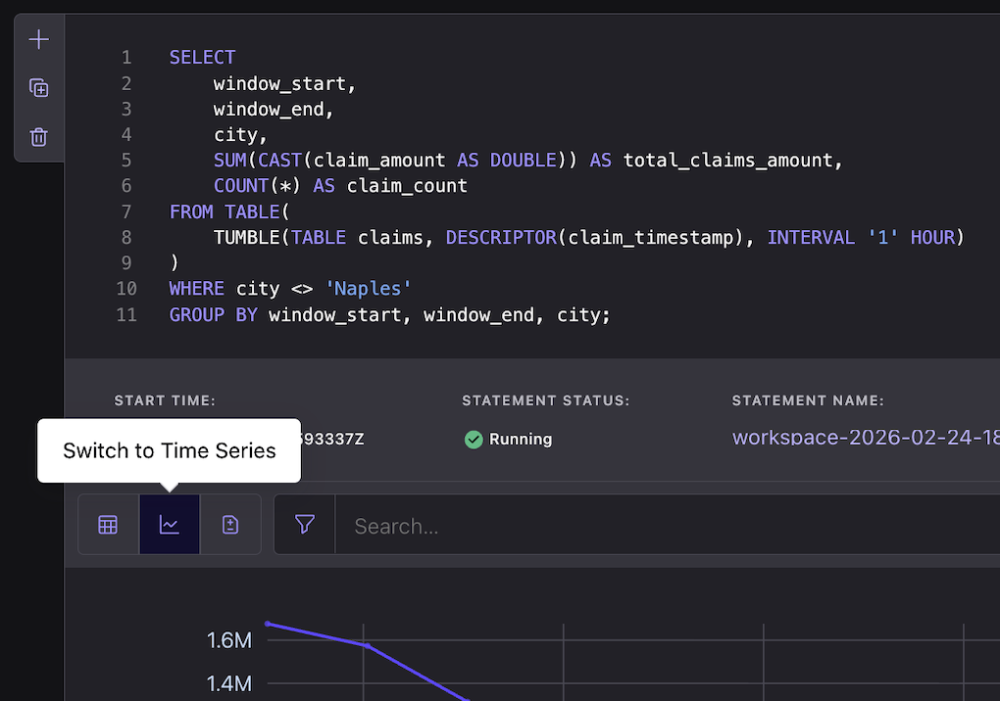
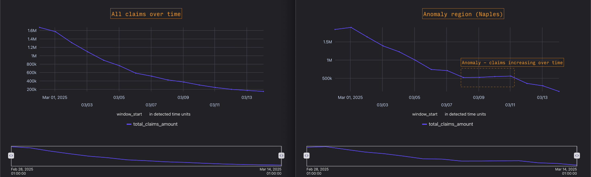

# Lab5: Insurance Claims Fraud Detection with IBM Watson X Integration



This demo showcases an intelligent, real-time fraud detection system that autonomously identifies suspicious insurance claim patterns and hands off high-risk cases to IBM Watson X Orchestrate for action. Built on [Confluent Intelligence](https://www.confluent.io/product/confluent-intelligence/) and integrated with IBM Watson X, the system demonstrates a two-agent architecture where Confluent Streaming Agents investigate fraud in real-time and Watson X Orchestrate takes appropriate action (customer notification, compliance review, payment blocking).

## Prerequisites

**Installation instructions:**

```bash
brew install uv git python && brew tap hashicorp/tap && brew install hashicorp/tap/terraform && brew install --cask confluent-cli
```

**Windows:**
```powershell
winget install astral-sh.uv Git.Git Hashicorp.Terraform ConfluentInc.Confluent-CLI Python.Python
```

Once software is installed, you'll need:
- **LLM API keys:** AWS Bedrock API keys **OR** Azure OpenAI endpoint + API key
  - **Easy key creation:** Run `uv run api-keys create` to quickly auto-generate credentials

**External Resources:**

Lab 5 connects to pre-configured external infrastructure (IBM MQ, CIS API, Watson X S3 bucket). These are created manually and shared across workshop attendees with read-only credentials. See [LAB5-MANUAL-SETUP.md](docs/archive/LAB5-MANUAL-SETUP.md) for setup instructions (workshop organizers only).

---

## Deploy the Demo

First, clone the repo:

```bash
git clone https://github.com/confluentinc/quickstart-streaming-agents.git
cd quickstart-streaming-agents
```

Once you have your credentials ready, run the deployment script and choose **Lab5**:

```bash
uv run deploy
```

The deployment script will prompt you for your:
- Cloud provider (AWS/Azure)
- LLM API keys (Bedrock keys or Azure OpenAI endpoint/key)
- Confluent Cloud credentials
- IBM Watson X credentials (for Agent-to-Agent handoff)

Select **"Lab 5: Insurance Fraud Detection with Watson X"** from the menu.

---

## Architecture Overview

Lab 5 implements an **end-to-end insurance fraud detection pipeline** integrating IBM and Confluent technologies:

### Data Flow

```
IBM MQ (IBM Cloud US South)
  └─> CLAIMSQM broker / DEV.CLAIMS.1 queue
        │
        ▼ [IBM MQ Source Connector]
  claim_mq topic (raw JMS envelopes)
        │
        ▼ [Flink INSERT — JMS envelope parse]
  claims table (19-field structured records)
        │
        ▼ [Flink ML_DETECT_ANOMALIES — 1hr tumbling windows, Naples only]
  claims_surge_windows (anomaly signal windows)
        │
        ▼ [Flink time-range JOIN]
  claims_anomalies (individual claims inside surge windows)
        │
        ▼ [Flink AI_RUN_AGENT — fraud_review_agent via Zapier MCP → CIS API]
  claims_reviewed (APPROVE/DENY verdicts, payment amounts)
        │
        ├─> Real Time Context Engine (not yet provisioned — see Known Gaps)
        │     └─> Serves claims_reviewed to external applications
        │
        └─> Tableflow (not yet provisioned — see Known Gaps)
              └─> Watson X Data Lakehouse (S3 + Iceberg)
```

### Components

1. **IBM MQ Source** (IBM Cloud US South)
   - Insurance claims system publishes to MQ `DEV.CLAIMS.1` queue (CLAIMSQM broker)
   - IBM MQ Source Connector streams JMS envelopes to Confluent Cloud `claim_mq` topic
   - Flink INSERT parses JMS envelopes into the structured `claims` table

2. **Confluent Flink — Anomaly Detection (2-stage)**
   - Stage 1: `ML_DETECT_ANOMALIES` on 1-hour tumbling windows → `claims_surge_windows`
   - Stage 2: Time-range JOIN against `claims` → `claims_anomalies` (individual flagged claims)

3. **Confluent Streaming Agent** (`fraud_review_agent`)
   - Reads from `claims_anomalies` via `AI_RUN_AGENT`
   - Calls Claims Investigation Service (CIS) REST API via Zapier MCP tool
   - Applies 5 fraud detection rules; outputs structured plain-text verdict
   - Writes APPROVE/DENY results with payment amounts to `claims_reviewed`

4. **Claims Investigation Service (CIS)** (AWS Lambda — external, pre-provisioned)
   - Endpoint: `ildw2o0gik.execute-api.us-east-1.amazonaws.com/prod/investigation/{claim_id}`
   - Returns claim, policy, CLUE history, and identity verification data
   - Source: `terraform/lab5-insurance-fraud-watson/cis/lambda_function.py`

5. **Real Time Context Engine** *(not yet provisioned)*
   - Would serve `claims_reviewed` topic to external applications via REST API

6. **Confluent Tableflow → Watson X Data Lakehouse** *(not yet provisioned)*
   - Would sink `claims_reviewed` to S3 in Iceberg format for historical analytics

---

## Use Case Walkthrough

### Data Generation

The Lab5 Terraform automatically publishes ~36,000 synthetic insurance claims across 8 Florida cities. The claims begin 14 days before the current date (simulating a hurricane disaster), and continue through today.

The data includes:
- **`claims`** table – synthetic insurance claims with applicant info, damage assessments, claim amounts, and detailed narratives

**Data Pattern:**
- **7 cities** show normal exponential decay (claims decrease over time)
- **1 city (Naples)** shows an anomalous spike in the final 2 days (Days 13-14), containing a mix of claims: some with fraud indicators, others with policy violations, and others still with fully legitimate claims.

**Demo Claims:**
Three specific claims are pre-configured with full investigation context in the Claims Investigation Service (CIS):
- **CLM-77093**: Auto total loss - likely intentional fraud (3rd claim in 24 months, vehicle purchased 6 weeks before incident)
- **CLM-88241**: Water damage - requires additional info (address mismatch, 60-day filing gap)
- **CLM-55019**: Auto collision - legitimate claim (clean history, all evidence supports)

---

### IBM MQ → Confluent Pipeline

Claims arrive via IBM MQ (hosted in AWS us-east-1). The IBM MQ Source Connector reads from the `DEV.CLAIMS.1` queue and writes JMS message envelopes as AVRO to the `claim_mq` topic. A Flink statement then parses the JSON payload inside each JMS envelope into the structured `claims` table.

The `claim_mq` table captures the raw JMS envelope:

```sql
CREATE TABLE IF NOT EXISTS `claim_mq` (
  `messageID`    STRING,
  `messageType`  STRING,
  `timestamp`    BIGINT,
  `deliveryMode` INT,
  `text`         STRING
);
```

The INSERT parses the nested JSON in the `text` field into individual typed columns:

```sql
INSERT INTO `claims`
SELECT
  JSON_VALUE(`text`, '$.value.claim_id')                          AS `claim_id`,
  JSON_VALUE(`text`, '$.value.applicant_name.string')             AS `applicant_name`,
  JSON_VALUE(`text`, '$.value.city')                              AS `city`,
  JSON_VALUE(`text`, '$.value.is_primary_residence.string')       AS `is_primary_residence`,
  JSON_VALUE(`text`, '$.value.damage_assessed.string')            AS `damage_assessed`,
  JSON_VALUE(`text`, '$.value.claim_amount')                      AS `claim_amount`,
  JSON_VALUE(`text`, '$.value.has_insurance.string')              AS `has_insurance`,
  JSON_VALUE(`text`, '$.value.insurance_amount.string')           AS `insurance_amount`,
  JSON_VALUE(`text`, '$.value.claim_narrative.string')            AS `claim_narrative`,
  JSON_VALUE(`text`, '$.value.assessment_date.string')            AS `assessment_date`,
  JSON_VALUE(`text`, '$.value.disaster_date.string')              AS `disaster_date`,
  JSON_VALUE(`text`, '$.value.previous_claims_count.string`)      AS `previous_claims_count`,
  JSON_VALUE(`text`, '$.value.last_claim_date.string`)            AS `last_claim_date`,
  JSON_VALUE(`text`, '$.value.assessment_source.string`)          AS `assessment_source`,
  JSON_VALUE(`text`, '$.value.shared_account.string`)             AS `shared_account`,
  JSON_VALUE(`text`, '$.value.shared_phone.string`)               AS `shared_phone`,
  TO_TIMESTAMP_LTZ(
    CAST(JSON_VALUE(`text`, '$.value.claim_timestamp') AS BIGINT),
    3
  )                                                               AS `claim_timestamp`
FROM `claim_mq`;
```

Both of these are deployed automatically by `uv run deploy`. You can verify data is flowing:

```sql
SELECT COUNT(*) FROM claims;
-- Should be ~36,000 after data generation completes
```

---

### 0. Visualize the Anomaly

Before running anomaly detection, you can view the raw claim patterns for yourself by running these two queries in the [Flink UI](https://confluent.cloud/go/flink):

**All other regions (normal decay):**

```sql
SELECT
    window_start,
    window_end,
    city,
    SUM(CAST(claim_amount AS DOUBLE)) AS total_claims_amount,
    COUNT(*) AS claim_count
FROM TABLE(
    TUMBLE(TABLE claims, DESCRIPTOR(claim_timestamp), INTERVAL '1' HOUR))
WHERE city <> 'Naples'
GROUP BY window_start, window_end, city;
```

**Anomaly region — Naples only (claims actually *increasing* on days 8-9):**

```sql
SELECT
    window_start,
    window_end,
    SUM(CAST(claim_amount AS DOUBLE)) AS total_claims_amount,
    COUNT(*) AS claim_count
FROM TABLE(
    TUMBLE(TABLE claims, DESCRIPTOR(claim_timestamp), INTERVAL '1' HOUR))
WHERE city = 'Naples'
GROUP BY window_start, window_end;
```

After running each query, click the **Switch to Time Series** chart in the UI to visualize the results:



All other regions show a steady downward slope as claims taper off post-disaster. Naples follows the same pattern initially, then spikes sharply upward — the anomaly:



---

### 1. Detect Fraud Spikes Using `ML_DETECT_ANOMALIES`

This step identifies unexpected surges in claim volume for Naples in real time. The pipeline is split into two stages: first detect which time windows are anomalous, then join those windows back to the raw claims to get the candidate claims for investigation.

Read the [blog post](https://docs.confluent.io/cloud/current/ai/builtin-functions/detect-anomalies.html) and view the [documentation](https://docs.confluent.io/cloud/current/flink/reference/functions/model-inference-functions.html#flink-sql-ml-anomaly-detect-function) on Flink anomaly detection for more details.

#### Stage 1A — Detect anomalous windows (`claims_surge_windows`)

**Run in the [Flink UI](https://confluent.cloud/go/flink):**

```sql
CREATE TABLE IF NOT EXISTS `claims_surge_windows` AS
WITH windowed AS (
    SELECT
        window_start,
        window_end,
        window_time,
        city,
        COUNT(*) AS claim_count,
        SUM(CAST(claim_amount AS DOUBLE)) AS total_claim_amount
    FROM TABLE(
        TUMBLE(TABLE `claims`, DESCRIPTOR(`claim_timestamp`), INTERVAL '1' HOUR)
    )
    WHERE city = 'Naples'
    GROUP BY window_start, window_end, window_time, city
)
SELECT
    window_start,
    window_end,
    city,
    claim_count,
    total_claim_amount,
    anomaly_result.upper_bound AS upper_bound
FROM (
    SELECT
        *,
        ML_DETECT_ANOMALIES(
            CAST(claim_count AS DOUBLE),
            window_time,
            JSON_OBJECT(
                'minTrainingSize' VALUE 3,
                'maxTrainingSize' VALUE 50,
                'confidencePercentage' VALUE 90.0,
                'enableStl' VALUE FALSE
            )
        ) OVER (
            PARTITION BY city
            ORDER BY window_time
            RANGE BETWEEN UNBOUNDED PRECEDING AND CURRENT ROW
        ) AS anomaly_result
    FROM windowed
)
WHERE anomaly_result.is_anomaly = TRUE
  AND CAST(claim_count AS DOUBLE) > anomaly_result.upper_bound;
```

**What it does:**
1. **Aggregates** claims into 1-hour tumbling windows, filtered to Naples only
2. **Applies `ML_DETECT_ANOMALIES`** on `claim_count` (volume, not amount) using ARIMA:
   - `minTrainingSize: 3` — needs 3 baseline windows before detecting
   - `confidencePercentage: 90.0` — flags windows that exceed the 90th-percentile upper bound
   - `enableStl: FALSE` — no seasonal decomposition needed for disaster-driven data
3. **Outputs only anomalous windows** where claim count exceeds the upper confidence bound

#### Stage 1B — Join anomalous windows back to raw claims (`claims_anomalies`)

```sql
CREATE TABLE IF NOT EXISTS `claims_anomalies` AS
SELECT
    c.`claim_id`,
    c.`applicant_name`,
    c.`city`,
    c.`claim_amount`,
    c.`damage_assessed`,
    c.`has_insurance`,
    c.`insurance_amount`,
    c.`is_primary_residence`,
    c.`claim_narrative`,
    c.`claim_timestamp`
FROM `claims` c
INNER JOIN `claims_surge_windows` w
    ON  c.`city`            = w.city
    AND c.`claim_timestamp` >= w.window_start
    AND c.`claim_timestamp` <  w.window_end
WHERE c.`claim_narrative` <> ''
  AND c.`has_insurance`   = 'yes';
```

**What it does:** Joins every individual claim from the `claims` stream against the anomalous surge windows. Only claims that fall inside a detected surge window, have a narrative, and have insurance are selected for investigation.

**View the results:**

```sql
SELECT * FROM claims_anomalies;
```

This table is the input to the fraud investigation agent in the next step.

---

### 2. Define the Fraud Review Agent

With anomalous claims collected in `claims_anomalies`, the next step is to create the **Confluent Streaming Agent** that investigates each one.

The agent connects to the **Claims Investigation Service (CIS)** via a Zapier MCP tool (`webhooks_by_zapier_get`). For each claim, it fetches the full investigation record (policy details, CLUE history, identity verification), applies 5 fraud detection rules in sequence, and outputs a structured plain-text verdict.

See [CREATE AGENT documentation](https://docs.confluent.io/cloud/current/flink/reference/statements/create-agent.html).

**First, create the MCP connection and tool:**

```sql
CREATE CONNECTION IF NOT EXISTS `zapier-mcp-connection`
WITH (
  'type'           = 'MCP_SERVER',
  'endpoint'       = 'https://mcp.zapier.com/api/v1/connect',
  'token'          = '<your-zapier-token>',
  'transport-type' = 'STREAMABLE_HTTP'
);

CREATE TOOL IF NOT EXISTS `claims_investigation_service`
USING CONNECTION `zapier-mcp-connection`
WITH (
  'type'             = 'mcp',
  'allowed_tools'    = 'webhooks_by_zapier_get',
  'request_timeout'  = '30'
);
```

**Then create the agent:**

```sql
CREATE AGENT `fraud_review_agent`
USING MODEL `llm_textgen_model`
USING PROMPT 'OUTPUT RULES — read before anything else:
1. Respond with ONLY these six labeled sections, in this exact order:
   Policy Coverage Amount:
   Policy Status:
   Verdict:
   Payment Amount:
   Issues Found:
   Summary:
2. NO markdown. No asterisks, no bold, no headers, no pound signs. Plain text only.
3. Verdict must be exactly one word: APPROVE or DENY.
4. Payment Amount: if APPROVE, the dollar amount to pay (never exceeds Policy Coverage Amount); if DENY, write $0.
5. Policy Coverage Amount: copy the exact coverage_amount value from the CIS response (e.g. $250,000).
6. Policy Status: copy the exact policy status value from the CIS response (e.g. active, lapsed, cancelled).

You are an insurance fraud review agent investigating flagged claims for hurricane damage in Naples, FL. Each claim was already identified as a statistical anomaly.

STEP 1 — FETCH INVESTIGATION DATA:
Before evaluating any fraud rules, you MUST call the webhooks_by_zapier_get tool to retrieve the full investigation record for this claim.
Use this URL: https://ildw2o0gik.execute-api.us-east-1.amazonaws.com/prod/investigation/{claim_id}
Replace {claim_id} with the claim_id provided in the input.
The response contains: policy owner name, coverage amount, policy status, policy history, CLUE history, ip_country, bank_account_country, identity_verified, ssn_matches_policyholder, identity_theft_history.

STEP 2 — APPLY FRAUD DETECTION RULES in order. Stop at the first DENY trigger.

RULE 1 — COVERAGE FRAUD: Was the policy purchased less than 30 days before the disaster?
RULE 2 — PRE-EXISTING DAMAGE: Does the CLUE history show a prior claim for the same damage type where "Repair recorded: no"?
RULE 3 — SANCTIONED COUNTRY / UNVERIFIABLE BANK: Is ip_country one of North Korea, Iran, or Russia? Is bank_account_country = "Unverifiable"?
RULE 4 — IDENTITY FAILURE: Is identity_verified = false or ssn_matches_policyholder = false?
RULE 5 — INACTIVE POLICY: Is policy.status anything other than "active"?

If all rules pass: APPROVE. Payment = min(claim_amount, policy.coverage_amount).'
USING TOOLS `claims_investigation_service`
WITH (
  'max_iterations' = '10'
);
```

**Agent output format** — the agent always returns exactly 6 plain-text fields:

```
Policy Coverage Amount: $250,000
Policy Status: active
Verdict: DENY
Payment Amount: $0
Issues Found:
- Policy purchased 2024-11-01, disaster occurred 2024-11-15. Only 14 days — less than the 30-day coverage fraud window.
Summary:
Claim denied. Policy was purchased within 30 days of the disaster, indicating potential coverage fraud.
```

The INSERT statement in the next step uses `REGEXP_EXTRACT` to parse these fields into columns.

---

### 3. Run the Agent and Generate Investigation Results

Now invoke the agent against every claim in `claims_anomalies`. First create the output table, then run the INSERT that streams agent verdicts into it.

See [AI_RUN_AGENT documentation](https://docs.confluent.io/cloud/current/flink/reference/functions/model-inference-functions.html#flink-sql-ai-run-agent-function).

**Create the output table:**

```sql
CREATE TABLE IF NOT EXISTS `claims_reviewed` (
  `claim_id`               STRING NOT NULL,
  `applicant_name`         STRING,
  `city`                   STRING,
  `claim_amount`           STRING,
  `policy_coverage_amount` STRING,
  `policy_status`          STRING,
  `verdict`                STRING,
  `payment_amount`         STRING,
  `issues_found`           STRING,
  `summary`                STRING,
  `raw_response`           STRING
);
```

**Run the agent against all flagged claims:**

```sql
INSERT INTO `claims_reviewed`
SELECT
    claim_id,
    applicant_name,
    city,
    claim_amount,
    TRIM(REGEXP_EXTRACT(CAST(response AS STRING), '\*{0,2}Policy Coverage Amount:\*{0,2}\s*(\$[\d,]+)', 1)) AS policy_coverage_amount,
    TRIM(REGEXP_EXTRACT(CAST(response AS STRING), '\*{0,2}Policy Status:\*{0,2}\s*(\S+)', 1))              AS policy_status,
    TRIM(REGEXP_EXTRACT(CAST(response AS STRING), '\*{0,2}Verdict:\*{0,2}\s*([A-Z]+)', 1))                 AS verdict,
    TRIM(REGEXP_EXTRACT(CAST(response AS STRING), '\*{0,2}Payment Amount:\*{0,2}\s*(\$[\d,]+)', 1))        AS payment_amount,
    TRIM(REGEXP_EXTRACT(CAST(response AS STRING), '\*{0,2}Issues Found:\*{0,2}\n([\s\S]+?)(?=\n\*{0,2}Summary:)', 1)) AS issues_found,
    TRIM(REGEXP_EXTRACT(CAST(response AS STRING), '\*{0,2}Summary:\*{0,2}\n([\s\S]+?)$', 1))               AS summary,
    CAST(response AS STRING) AS raw_response
FROM `claims_anomalies`,
LATERAL TABLE(AI_RUN_AGENT(
    `fraud_review_agent`,
    CONCAT(
        'CLAIM FOR REVIEW: ', claim_id, '\n',
        'Applicant: ', applicant_name, '\n',
        'City: ', city, '\n',
        'Claim Amount: $', claim_amount, '\n',
        'Damage Assessed: $', COALESCE(damage_assessed, 'N/A'), '\n',
        'Has Insurance: ', COALESCE(has_insurance, 'unknown'), '\n',
        'Insurance Payout: $', COALESCE(insurance_amount, 'N/A'), '\n',
        'Is Primary Residence: ', COALESCE(is_primary_residence, 'unknown'), '\n',
        'Claim Narrative: ', COALESCE(claim_narrative, '(none)')
    )
));
```

**What it does:**
1. For each row in `claims_anomalies`, calls `AI_RUN_AGENT` which invokes `fraud_review_agent`
2. The agent fetches investigation data from the CIS API via the Zapier MCP tool
3. Applies 5 fraud rules and produces a plain-text verdict
4. `REGEXP_EXTRACT` parses the 6 labeled sections into individual columns
5. Results are continuously written to `claims_reviewed`

**View the investigation results:**

```sql
SELECT
    claim_id,
    applicant_name,
    verdict,
    payment_amount,
    policy_status,
    issues_found
FROM claims_reviewed;
```

Expected output for the three demo claims:

| claim_id | verdict | payment_amount | policy_status |
|----------|---------|----------------|---------------|
| CLM-77093 | DENY | $0 | active |
| CLM-88241 | DENY | $0 | active |
| CLM-55019 | APPROVE | $187,500 | active |

The `claims_reviewed` topic now contains all investigated claims and serves two purposes:
1. **Real-Time Access**: Served by Real Time Context Engine to external applications
2. **Historical Analytics**: Sinked to S3 via Tableflow (see next step)

---

### 4. Real Time Context Engine - Serve Claims to External Applications

> **Not yet provisioned.** This section describes the intended integration. Real Time Context Engine is not currently configured in Terraform — it is the next step for the IBM team to implement.

Once provisioned, Real Time Context Engine exposes the `claims_reviewed` topic to external applications via REST API:

1. Enable Real Time Context Engine in Confluent Cloud
2. Register the `claims_reviewed` topic as a queryable resource
3. Create API endpoints for real-time lookups by `claim_id`, `verdict`, or `city`

**Example API Usage (once provisioned):**

```bash
# Check fraud investigation status for a specific claim
curl -X GET "https://<rtce-endpoint>/claims/CLM-77093" \
  -H "Authorization: Bearer $API_KEY"

# Response:
{
  "claim_id": "CLM-77093",
  "verdict": "DENY",
  "payment_amount": "$0",
  "issues_found": "Policy purchased 2 days before disaster. Coverage fraud.",
  "summary": "Claim denied. Policy purchased within 30-day fraud window."
}
```

External applications (mobile apps, compliance dashboards, customer portals) can then access real-time fraud status via this API.

---

### 5. Tableflow to Watson X Data Lakehouse

> **Not yet provisioned.** This section describes the intended integration. The Tableflow sink connector is not currently configured in Terraform — it is the next step for the IBM team to implement. The `claims_reviewed` Kafka topic is populated and ready; only the sink connector is missing.

Use Tableflow to sink `claims_reviewed` to **IBM Watson X Data Lakehouse** for historical analytics:

**Tableflow Connector Configuration:**

1. **Create Tableflow Sink Connector** in Confluent Cloud:
   - **Source Topic**: `claims_reviewed`
   - **Target**: Watson X Data Lakehouse (AWS S3 bucket with Iceberg format)
   - **Format**: Apache Iceberg
   - **Table Name**: `claims_reviewed_iceberg`
   - **Credentials**: AWS IAM role with S3 write permissions

2. **Iceberg Table Schema** (matches actual `claims_reviewed` topic):
   ```sql
   CREATE TABLE claims_reviewed_iceberg (
       claim_id              STRING,
       applicant_name        STRING,
       city                  STRING,
       claim_amount          STRING,
       policy_coverage_amount STRING,
       policy_status         STRING,
       verdict               STRING,
       payment_amount        STRING,
       issues_found          STRING,
       summary               STRING
   )
   PARTITIONED BY (days($__commit_time))
   LOCATION 's3://<bucket-name>/claims_reviewed/'
   ```

**Sample Analytics Queries (Watson X Data Lakehouse):**

```sql
-- Fraud trends by region
SELECT
    city,
    COUNT(*) AS total_investigations,
    COUNT(CASE WHEN verdict = 'DENY' THEN 1 END) AS fraud_denials,
    AVG(CAST(claim_amount AS DOUBLE)) AS avg_claim_amount
FROM claims_reviewed_iceberg
GROUP BY city
ORDER BY fraud_denials DESC;

-- Verdict summary
SELECT
    verdict,
    COUNT(*) AS count,
    AVG(CAST(payment_amount AS DOUBLE)) AS avg_payment
FROM claims_reviewed_iceberg
GROUP BY verdict;
```

---

## Conclusion

By integrating Confluent Intelligence with IBM MQ and Watson X, this demo builds a real-time fraud detection pipeline that:

1. **Ingests** insurance claims from IBM MQ (IBM Cloud US South) into `claim_mq` via IBM MQ Source Connector, then parses the JMS envelope into the `claims` table via a Flink INSERT
2. **Detects** anomalous surge windows in 1-hour tumbles for Naples using `ML_DETECT_ANOMALIES` on claim volume → `claims_surge_windows`; joins those windows back to raw claims → `claims_anomalies`
3. **Investigates** each flagged claim using `fraud_review_agent`, a Confluent Streaming Agent that calls the Claims Investigation Service via Zapier MCP, applies 5 fraud detection rules, and writes verdicts to `claims_reviewed`
4. **Serves** real-time fraud status to external applications via Real Time Context Engine *(not yet provisioned)*
5. **Archives** investigation results to Watson X Data Lakehouse via Tableflow → `claims_reviewed_iceberg` in S3/Iceberg format *(not yet provisioned)*

**Key Technologies:**
- **IBM MQ** - Enterprise messaging source
- **Confluent Cloud** - Real-time event streaming and AI
- **Confluent Flink** - Anomaly detection and stream processing
- **Confluent Streaming Agents** - Autonomous fraud investigation
- **Zapier MCP** - CIS API integration layer for agent tool calls
- **Real Time Context Engine** - API layer for external applications
- **Tableflow** - Seamless integration to data lakehouse
- **Watson X Data Lakehouse** - Historical analytics (S3 + Iceberg format)

The result is an event-driven architecture where Confluent orchestrates real-time fraud detection and investigation, while IBM Watson X provides domain expertise, investigation context, and historical analytics capabilities.

---

## Known Gaps

The following items are referenced in this walkthrough but are **not yet provisioned** in Terraform. They represent the next phase of the IBM integration:

- **Watson X Tableflow sink** — `claims_reviewed` topic is live but not wired to S3/Iceberg. Placeholder local variables (`watsonx_s3_bucket`, `watsonx_s3_region`) exist in `main.tf` but no Terraform resource creates the connector.
- **Real Time Context Engine** — described in Step 4 above, but no Terraform resource provisions it.
- **`claims_investigation` table** — present in Terraform but never populated. Remnant of a prior design that used HTTP Source V2 to poll Watson X; replaced by the agent calling the CIS API directly. Can be removed.
- **IBM MQ credentials in `main.tf`** — hostname, username, and password for the IBM MQ broker are hard-coded in locals. Before broader distribution, move these to `variables.tf` or supply via `terraform.tfvars`.

---

## Troubleshooting

<details>
<summary>Click to expand</summary>

### No claims appearing in claims_reviewed?

**Check:**
1. Verify `claims_anomalies` has data: `SELECT COUNT(*) FROM claims_anomalies;`
2. Verify the agent INSERT is running: check Flink statement status in Confluent Cloud UI
3. Check Zapier MCP connection is active — the agent calls `webhooks_by_zapier_get`; verify the token in the `zapier-mcp-connection` is valid

### No anomalies detected?

**Check:**
1. Re-publish data: `python scripts/lab5_mq_publisher.py`
2. Claims published to topic: `SELECT COUNT(*) FROM claims;` (should be ~36,000)
3. Wait for baseline: ARIMA needs 3 baseline windows (1-hour windows) before detecting

### Tableflow sink not working?

**Check:**
1. Watson X Data Lakehouse supports Iceberg/S3 (verify with IBM)
2. Tableflow connector has correct S3 credentials
3. Check connector status in Confluent Cloud UI

</details>

---

## 🧹 Clean-up

When you're done with the lab:

```bash
uv run destroy
```

Choose your cloud provider when prompted to remove all lab-related resources.

---

---

## Additional Components

### Claims Investigation Service (CIS)

The CIS is a FastAPI mock service that provides comprehensive claim context. For production deployment, this would integrate with real enterprise systems (claims management, policy admin, customer database, property records).

**Quick Start (Local Development):**

```bash
cd terraform/lab5-insurance-fraud-watson/cis
pip install fastapi uvicorn
uvicorn main:app --reload --port 8000
```

The CIS serves three pre-configured demo scenarios:
- `GET /investigation/CLM-77093` - Returns fraud case data
- `GET /investigation/CLM-88241` - Returns info request case
- `GET /investigation/CLM-55019` - Returns legitimate claim

See [docs/archive/fraud-claims-agent-spec.md](./docs/archive/fraud-claims-agent-spec.md) for full API documentation and implementation guide.

---

## Navigation

- **← Back to Overview**: [Main README](./README.md)
- **← Previous Lab**: [Lab4: FEMA Fraud Detection](./LAB4-Walkthrough.md)
- **📋 Implementation Spec**: [Watson X Agent Specification](./docs/archive/fraud-claims-agent-spec.md)
- **🧹 Cleanup**: [Cleanup Instructions](./README.md#cleanup)
