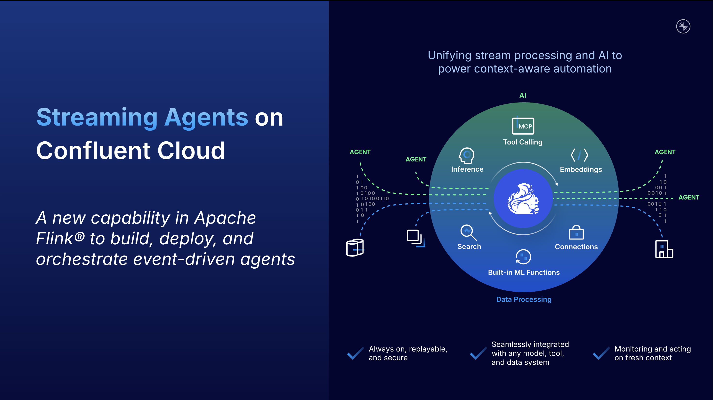
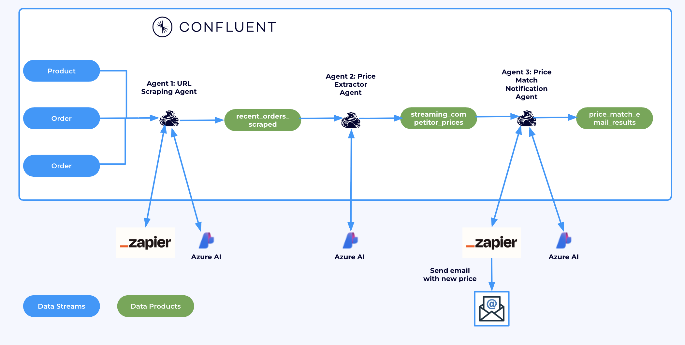
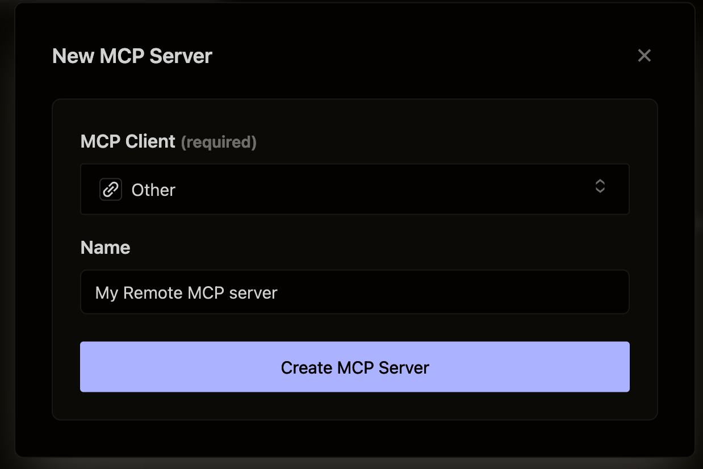
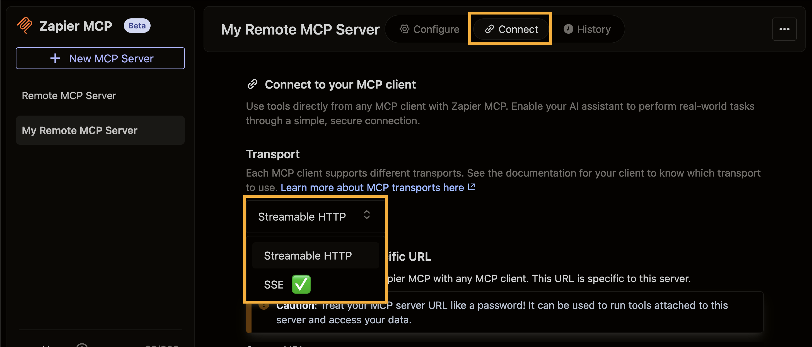
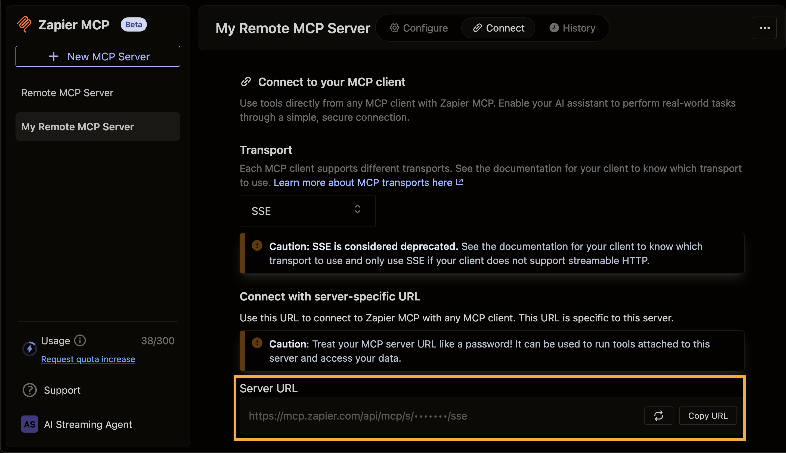

# Streaming Agents on Confluent Cloud Quickstart



This repository demonstrates how an online retailer can use Streaming Agents on Confluent Cloud to perform real-time price matching on sales orders. Whenever a customer makes a purchase, the AI agent automatically scrapes a competitor's product page for the item via tool calling. If the competitor offers the same item at a lower price, the agent adjusts the order price accordingly, and sends an updated confirmation email to the customer — also using tool calling.



## 🎯 Essential Setup (Complete First!)

Before proceeding with any other steps, you **must** complete these essential prerequisites:

### 1. 🔑 Create Required Accounts & API Keys

1. **Confluent Cloud Account**

   [](https://confluent.cloud/signup)

   [Log into your account](https://confluent.cloud/login)
   - Create [Cloud Resource Management API Keys with Organization Admin permissions](https://docs.confluent.io/cloud/current/security/authenticate/workload-identities/service-accounts/api-keys/overview.html#resource-scopes)

2. **Zapier MCP Server** - [Sign up for free](https://zapier.com/sign-up)
   - Get your MCP server URL (detailed instructions below)

<details>
<summary>🔧 <strong>Zapier MCP Server Setup Instructions</strong></summary>

### Setting up your Zapier Remote MCP Server

1. **Create Zapier Account**

   - Sign up for an account at [https://zapier.com/sign-up.
   - Click the verification link they send to your email.

2. **Create MCP Server**

   - Visit [https://mcp.zapier.com/mcp/servers](https://mcp.zapier.com/mcp/servers) to create an MCP server.
   - For "MCP Client", choose **"Other"**
   - Give your MCP server a name.
   - Click **"Create MCP Server."**

   

3. **Add Tools**

   - Click **"Add tool."**

     

   - Add **Webhooks by Zapier: GET** tool.

   - Add **Gmail: Send Email** tool (authenticate via SSO).

4. **Get Your MCP Server URL**

   - From the Zapier MCP server main screen, click **"Connect."**

     

   - Under "Transport", change from "Streamable HTTP" to **"SSE Endpoint."**

   - Click **"Copy URL"** in the bottom right.

     

   - Your URL format will be: `https://mcp.zapier.com/api/mcp/s/<<long-API-key>>/sse`

   - ⭐ **Save this URL** - you'll need it for your `terraform.tfvars` file
   

</details>

## 📋 Install Required Software

- **AWS CLI or Azure CLI** 
- **Confluent CLI**
- **Docker**
- **Terraform**

<details>
<summary>Installing prerequisites on Mac</summary>

```bash
# Core tools
brew install git && brew tap hashicorp/tap && brew install hashicorp/tap/terraform && brew install --cask confluent-cli && brew install --cask docker-desktop
```

**Cloud provider CLI (choose based on your preference):**

```bash
brew install awscli
```

or:
```bash
brew install azure-cli
```

</details>

<details>
<summary>Installing prerequisites on Windows</summary>

```powershell
# Core tools
winget install --id Git.Git -e && winget install --id Hashicorp.Terraform -e && winget install --id ConfluentInc.Confluent-CLI -e && winget install --id Docker.DockerDesktop -e
```

**Cloud provider CLI (choose based on your preference):**

```powershell
winget install --id Amazon.AWSCLI -e
```

or:
```powershell
winget install --id Microsoft.AzureCLI -e
```

</details>

## 🚀 Quick Start Deployment

### 1. Clone the Repository

```bash
git clone https://github.com/confluentinc/quickstart-streaming-agents.git
cd quickstart-streaming-agents/terraform
```

### 2. Configure Your Credentials

Open the `terraform.tfvars` file:

macOS:

```bash
open -a TextEdit terraform.tfvars
```

Windows:

```bash
notepad terraform.tfvars
```

Fill in out the values for `prefix`, `cloud_provider`, `cloud_region`, `confluent_cloud_api_key`, `confluent_cloud_api_secret`, and `ZAPIER_SSE_ENDPOINT` and save the file.

<details>
<summary><strong>📋 Supported Regions</strong> (Click to expand)</summary>

**Azure Regions:**
- **US**: East US, East US 2, Central US, North Central US, South Central US, West US, West US 2, West US 3
- **Europe**: North Europe, West Europe, UK South, UK West, France Central, Germany West Central
- **Asia**: East Asia, Southeast Asia, Japan East, Japan West, Korea Central, Korea South

**AWS Regions:**
- **US**:us-east-1, us-east-2, us-west-2
- **Europe**: eu-west-1, eu-west-2, eu-central-1
- **Asia**: ap-southeast-1, ap-southeast-2, ap-northeast-1

</details>

### 2A. [AWS ONLY] 🔓 Enable Claude Sonnet 3.7

<details>
<summary>🔧 Extra step required for AWS users</summary>

To enable **Claude 3.7 Sonnet** in your AWS account via Amazon Bedrock:

1. Open the [Amazon Bedrock Console](https://console.aws.amazon.com/bedrock/home?/overview), make sure you are in the same region.
2. In the left sidebar, under **Bedrock configuration**, click **Model access**.
3. Locate **Claude 3.7 Sonnet** in the list of available models.
4. Click **Available to request**, then select **Request model access**.
5. In the request wizard, click **Next** and follow the prompts to complete the request.


⏱️ *Provisioning may take 5–10 minutes.*

</details>

### 3. Deploy with Terraform


<details>
<summary>Deploying on Azure</summary>

1. Enable the the `providers-azure.tf` file

macOS:

```bash
mv providers-azure.tf.disabled providers-azure.tf 
```
Windows:

```bash
rename providers-azure.tf.disabled providers-azure.tf
```
2. Apply the terraform script

```bash
terraform init
terraform apply --auto-approve
```

</details>

<details>
<summary>Deploying on AWS</summary>

1. Enable the the `providers-aws.tf` file

macOS:

```bash
mv providers-aws.tf.disabled providers-aws.tf 
```
Windows:

```bash
rename providers-aws.tf.disabled providers-aws.tf
```
2. Apply the terraform script

```bash
terraform init
terraform apply --auto-approve
```

</details>


## Set up Flink MCP connection and models

The Terraform script has already created a Flink connection to your chosen LLM model (AWS or Azure).

To enable **Flink tool calling**, you also need to create a Flink connection to your **MCP server**.

1. Open the `mcp_commands.txt` file (auto-generated by the terraform script) located in the `terraform` directory of this repository.
   <details>
   <summary>macOS:</summary>
   
   ```bash
   open mcp_commands.txt
   ```
   
   </details>
   

   <details>
   <summary>Windows:</summary>
   
   ```bash
   notepad mcp_commands.txt
   ```
   </details>
   
3. Log in with Confluent CLI, then run the `confluent flink connection create` command at the top of `mcp_commands.txt`. It should look like this:
  
   ```bash
   confluent flink connection create zapier-mcp-connection \
     --cloud AZURE \
     --region eastus \
     --type mcp_server \
     --endpoint https://mcp.zapier.com/api/mcp/s/<<long-API-key>> \
     --api-key api_key \
     --environment env-xxxxx \
     --sse-endpoint https://mcp.zapier.com/api/mcp/s/<<long-API-key>>/sse
   ```

Once complete, Flink will be connected to both the LLM model and the MCP server.

3. Open a [Flink SQL Workspace in Confluent Cloud](https://confluent.cloud/workspaces/) and enter the `CREATE MODEL` commands found directly below the Flink connection command in `mcp_commands.txt`. They should look like this:

   ```sql
   CREATE MODEL `zapier_mcp_model`
   INPUT (prompt STRING)
   OUTPUT (response STRING)
   WITH (
     'provider' = 'azureopenai',
     'task' = 'text_generation',
     'azureopenai.connection' = 'streaming-agents-azure-openai-connection',
     'mcp.connection' = 'zapier-mcp-connection'
   );
   
   CREATE MODEL `llm_textgen_model`
   INPUT (prompt STRING)
   OUTPUT (response STRING)
   WITH(
     'provider' = 'azureopenai',
     'task' = 'text_generation',
     'azureopenai.connection' = 'streaming-agents-azure-openai-connection'
   );
   ```

## 📊 Data Generation

After successful terraform deployment, generate sample data:

```bash
cd data-gen/
```

Download the ShadowTraffic license file:

```bash
curl -O https://raw.githubusercontent.com/ShadowTraffic/shadowtraffic-examples/master/free-trial-license-docker.env
```

<details>
<summary>Click to expand Unix instructions</summary>

Run ShadowTraffic to generate data:
```bash
./run.sh
```

</details>

<details>
<summary>Click to expand Windows instructions</summary>

Run ShadowTraffic to generate data:
```cmd
run.bat
```

</details>

🎉 **Data is now flowing through your streaming pipeline!**

## Run SQL queries to call tools

After setting up the MCP connection and generating data, run these SQL queries in your Flink SQL Workspace to implement the streaming agent price match pipeline:

### Step 1: Stream Recent Orders with Competitor Scraping

```sql
-- Get recent orders, scrape competitor website for same product
SET 'sql.state-ttl' = '1 HOURS';
CREATE TABLE recent_orders_scraped AS
SELECT
    o.order_id,
    p.product_name,
    c.customer_email,
    o.price as order_price,
    (AI_TOOL_INVOKE(
        'zapier_mcp_model', 
        CONCAT('Use the webhooks_by_zapier_get tool to extract page contents. Instructions: Extract the page contents from the following URL: https://www.walmart.com/search?q="', 
               p.product_name, '"'),
        MAP[],
        MAP['webhooks_by_zapier_get', 'Fire off a single GET request with optional querystrings.'],
        MAP['debug', 'true', 'on_error', 'continue']
    ))['webhooks_by_zapier_get']['response'] as page_content
FROM orders o
JOIN customers c ON o.customer_id = c.customer_id  
JOIN products p ON o.product_id = p.product_id;
```

### Step 2: Extract Competitor Prices from Scraped Content

```sql
-- Extract prices from scraped webpages using AI_COMPLETE
CREATE TABLE streaming_competitor_prices AS
SELECT
    ros.order_id,
    ros.product_name,
    ros.customer_email,
    ros.order_price,
    llm.response as extracted_price
FROM recent_orders_scraped ros
CROSS JOIN LATERAL TABLE(
    AI_COMPLETE('llm_textgen_model', 
        CONCAT('Analyze this search results page for the following product name: "', ros.product_name, 
               '", and extract the price of the product that most closely matches the product name. Return only the price in format: XX.XX. For example, return only: 29.95. Page content: ', 
               ros.page_content)
    )
) AS llm
WHERE ros.page_content IS NOT NULL 
  AND ros.page_content NOT LIKE 'MCP error%'
  AND ros.page_content <> '';
```

### Step 3: Generate and Send Email Notifications for Price Matches

```sql
-- Create and send email notifications for price matches
CREATE TABLE price_match_email_results AS
SELECT 
    scp.order_id,
    scp.customer_email,
    scp.product_name,
    scp.order_price,
    CAST(scp.extracted_price AS DECIMAL(10,2)) as competitor_price,
    AI_TOOL_INVOKE('zapier_mcp_model', 
                   CONCAT('Use the gmail_send_email tool to send an email. Instructions: send yourself an email to your own email address, subject "Price match alert: Order #', scp.order_id, '", body "Original sale price: $', CAST(scp.order_price AS STRING), '. Price matched price: $', scp.extracted_price, '. Customer email address on file: ', scp.customer_email, '. Simulated customer notification: We have processed a price match refund for your ', scp.product_name, ' purchase."'), 
                   MAP[], 
                   MAP['gmail_send_email', 'Create and send a new email message'],
                   MAP['debug', 'true']) as email_response 
FROM streaming_competitor_prices scp
WHERE scp.order_price > CAST(scp.extracted_price AS DECIMAL(10,2))
  AND scp.extracted_price IS NOT NULL
  AND scp.extracted_price <> ''
  AND CAST(scp.extracted_price AS DECIMAL(10,2)) > 0;
```

## Topics

**Next topic:** [Lab1: Price Matching using Tool calling](./LAB1-Tool-Calling/LAB1.md)

## 🧹 Cleanup

To destroy all resources when you're done:

```bash
cd ../terraform
terraform destroy --auto-approve
```

---

## ⚡ Summary Checklist

- [ ] Created Confluent Cloud account with API keys
- [ ] Set up Zapier MCP server and copied SSE endpoint URL
- [ ] Obtained Firecrawl API key
- [ ] Installed required software (Terraform, Confluent CLI, Docker)
- [ ] Cloned repository and configured `terraform.tfvars`
- [ ] [AWS only] Enabled Claude Sonnet 3.7 in Bedrock
- [ ] Deployed infrastructure with Terraform
- [ ] Generated sample data with ShadowTraffic

Need help? Check that all prerequisites are completed and credentials are correctly entered in your `terraform.tfvars` file.
