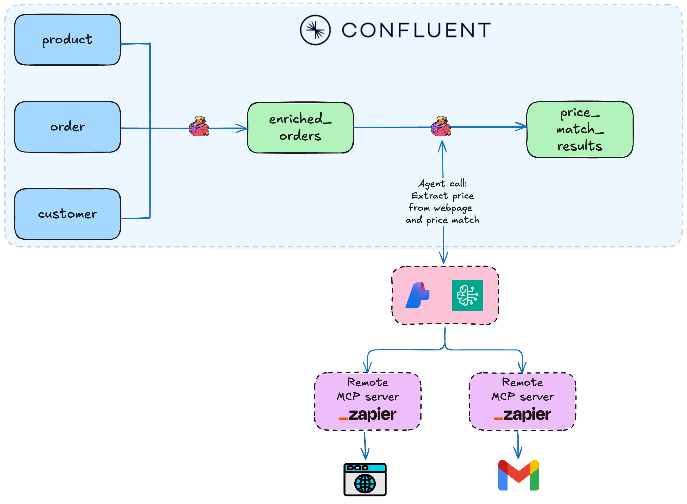
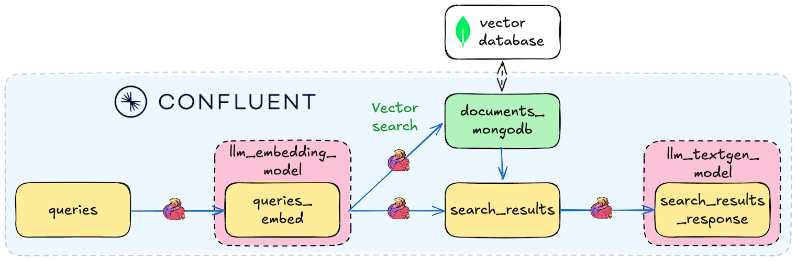
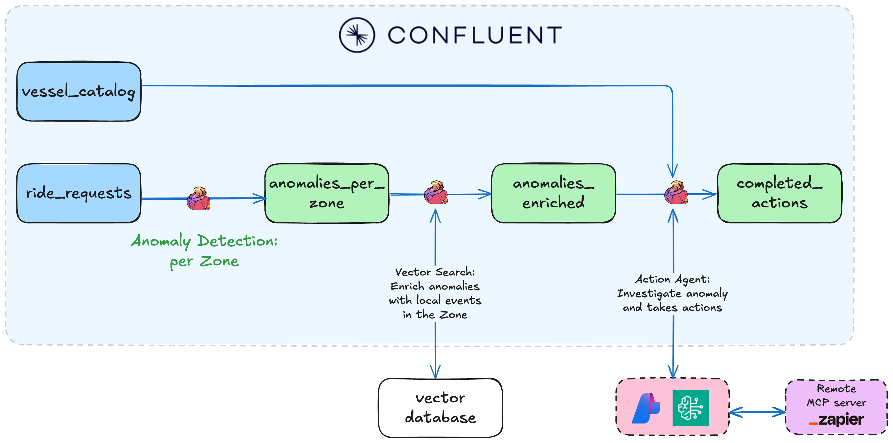
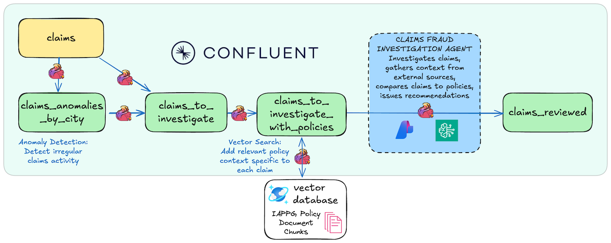

# Streaming Agents on Confluent Cloud Quickstart

[](https://www.confluent.io/get-started/?utm_campaign=tm.pmm_cd.q4fy25-quickstart-streaming-agents&utm_source=github&utm_medium=demo)

<div align="center">
  <a href="https://www.youtube.com/watch?v=3fWMD3qqBR8">
    
  </a>
</div>

Build real-time AI agents with [Confluent Cloud Streaming Agents](https://docs.confluent.io/cloud/current/ai/streaming-agents/overview.html). This quickstart includes three hands-on labs:

<table>
<tr>
<th width="25%">Lab</th>
<th width="75%">Description</th>
</tr>
<tr>
<td><a href="./LAB1-Walkthrough.md"><strong>Lab1 - Price Matching Orders With MCP Tool Calling</strong></a></td>
<td><b>*NEW!*</b> Now using new Agent Definition (CREATE AGENT) syntax. Price matching agent that scrapes competitor websites and adjusts prices in real-time.<br><br></td>
</tr>
<tr>
<td><a href="./LAB2-Walkthrough.md"><strong>Lab2 - Vector Search & RAG</strong></a></td>
<td>Vector search pipeline template with retrieval augmented generation (RAG). Use the included Flink documentation chunks, or bring your own documents for intelligent document retrieval.<br><br></td>
</tr>
<tr>
<td><a href="./LAB3-Walkthrough.md"><strong>Lab3 - Agentic Fleet Management Using Confluent Intelligence</strong></a></td>
    <td>End-to-end boat fleet management demo showing use of Agent Definition, MCP tool calling, vector search, and <a href="https://docs.confluent.io/cloud/current/ai/builtin-functions/detect-anomalies.html">anomaly detection</a>.<br><br></td>
</tr>
<tr>
<td><a href="./LAB4-Walkthrough.md"><strong>Lab4 - Public Sector Insurance Claims Fraud Detection Using Confluent Intelligence</strong></a></td>
<td>Real-time fraud detection system that autonomously identifies suspicious claim patterns in disaster insurance claims applications using anomaly detection, pattern recognition, and LLM-powered analysis.<br><br></td>
</tr>
</table>

## Prerequisites

**Required accounts & credentials:**

- [](https://www.confluent.io/get-started/?utm_campaign=tm.pmm_cd.q4fy25-quickstart-streaming-agents&utm_source=github&utm_medium=demo)
- **LLM Provider:** AWS Bedrock API keys **OR** Azure OpenAI keys
- **Lab1, Lab3, and Lab4:** Free Zapier remote MCP server ([Setup guide](./assets/pre-setup/Zapier-Setup.md))

**Required tools:**

- **[Confluent CLI](https://docs.confluent.io/confluent-cli/current/overview.html)** - must be logged in
- **[Docker](https://github.com/docker)** - for Lab1 & Lab3 data generation only
- **[Git](https://github.com/git/git)**
- **[Terraform](https://github.com/hashicorp/terraform)**
- **[uv](https://github.com/astral-sh/uv)**
- **[AWS CLI](https://github.com/aws/aws-cli)** or **[Azure CLI](https://github.com/Azure/azure-cli)** tools for generating API keys

<details>
<summary> Installation commands (Mac/Windows)</summary>
**Mac:**

```bash
brew install uv git python && brew tap hashicorp/tap && brew install hashicorp/tap/terraform && brew install --cask confluent-cli docker-desktop && brew install awscli # or azure-cli
```

**Windows:**

```powershell
winget install astral-sh.uv Git.Git Docker.DockerDesktop Hashicorp.Terraform ConfluentInc.Confluent-CLI Python.Python
```
</details>

## 🚀 Quick Start

**1. Clone the repository and navigate to the Quickstart directory:**

```bash
git clone https://github.com/confluentinc/quickstart-streaming-agents.git
cd quickstart-streaming-agents
```
**2. Auto-generate AWS Bedrock or Azure OpenAI keys:**

```bash
# Creates API-KEYS-[AWS|AZURE].md and auto-populates them in next step
uv run api-keys create
```

3. **One command deployment:**

```bash
uv run deploy
```

That's it! The script will autofill generated credentials and guide you through setup and deployment of your chosen lab(s).
> [!NOTE]
>
> See the [Workshop Mode Setup Guide](./assets/pre-setup/Workshop-Mode-Setup.md) for details about auto-generating API keys and tips for running demo workshops.

## Directory Structure

```
quickstart-streaming-agents/
├── terraform/                          
│   ├── core/                           # Shared Confluent Cloud infra for all labs
│   ├── lab1-tool-calling/
│   ├── lab2-vector-search/
│   └── lab3-agentic-fleet-management/
|   └── lab4-pubsec-fraud-agents/
├── deploy.py                           # Start here with uv run deploy
└── scripts/                            # Python utilities invoked with uv
```

## Cleanup

```bash
# Automated
uv run destroy
```

## Sign up for early access to Flink AI features

For early access to exciting new Flink AI features, [fill out this form and we'll add you to our early access previews.](https://events.confluent.io/early-access-flink-features)