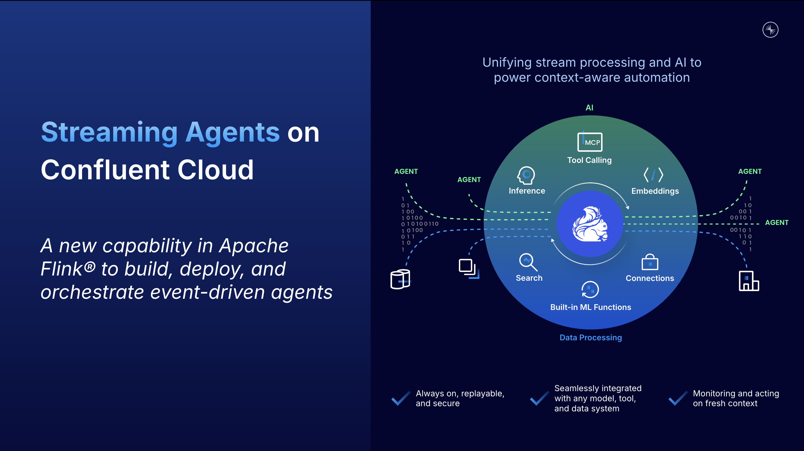
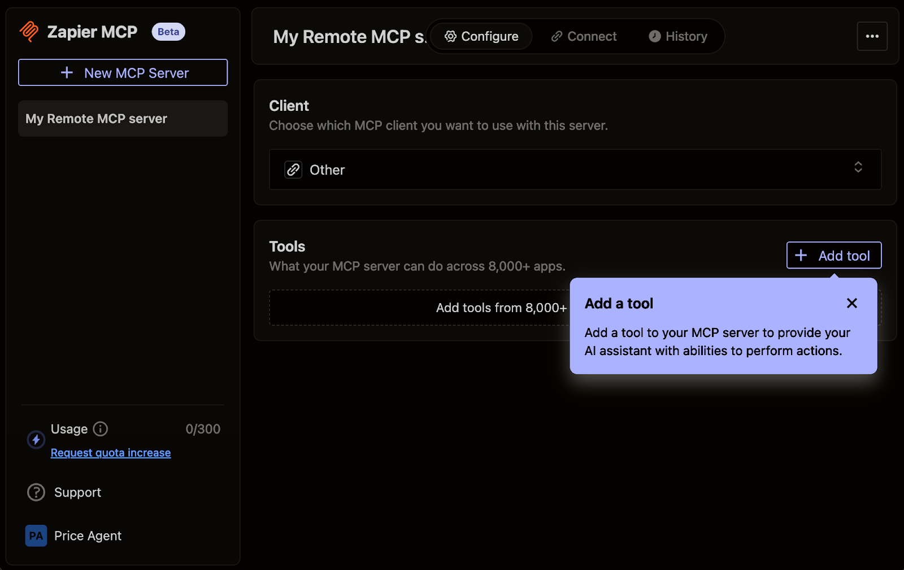
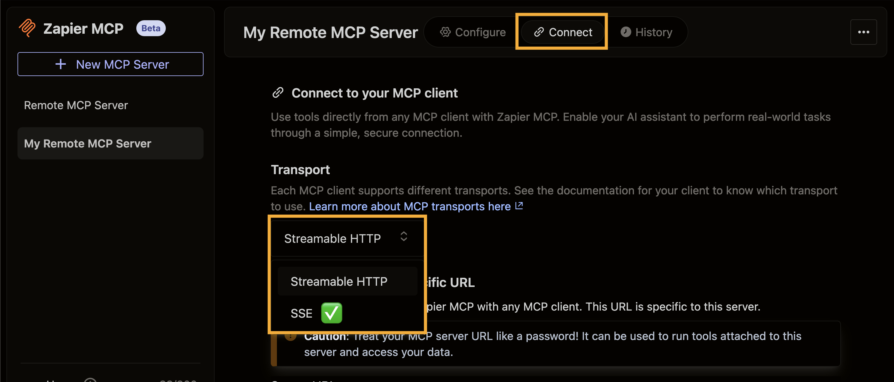
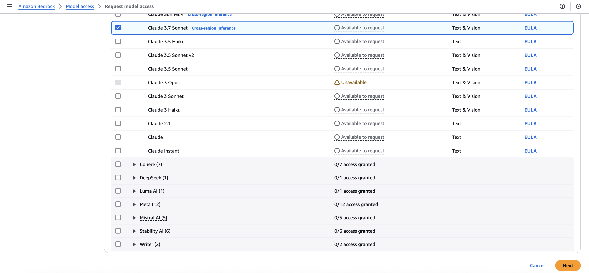

# Streaming Agents on Confluent Cloud Quickstart



This repository demonstrates how an online retailer can use [Streaming Agents](https://docs.confluent.io/cloud/current/ai/streaming-agents/overview.html) on Confluent Cloud to perform real-time price matching on sales orders. Whenever a customer makes a purchase, the AI agent automatically scrapes a competitor's product page for the item via tool calling. If the competitor offers the same item at a lower price, the agent adjusts the order price accordingly, and sends an updated confirmation email to the customer — also using tool calling.


## Demo Video

[](https://www.youtube.com/watch?v=F4bUUsVDBVE "Watch on YouTube")

## 🚀 Getting Started

This project uses a modular Terraform workflow. Follow these steps to get up and running quickly.

### 1. Prerequisites

- **Install CLIs:** Make sure you have the following command-line tools installed:
  - [`confluent`](https://docs.confluent.io/confluent-cli/current/install.html)
  - [`terraform`](https://developer.hashicorp.com/terraform/tutorials/aws-get-started/install-cli)
  - Your chosen cloud provider's CLI: [`aws`](https://docs.aws.amazon.com/cli/latest/userguide/getting-started-install.html) or [`az`](https://docs.microsoft.com/en-us/cli/azure/install-azure-cli)

- **Log in to CLIs:**
  - `confluent login --save`
  - `aws configure` (if using AWS)
  - `az login` (if using Azure)

- **Zapier MCP Server:** You will need a Zapier SSE Endpoint URL. Follow the instructions below to create one.

<details>
<summary>🔧 <strong>Zapier MCP Server Setup Instructions</strong></summary>

1. **Create Zapier Account**

   - Sign up for an account at [https://zapier.com/sign-up].
   - Click the verification link they send to your email.

2. **Create MCP Server**

   - Visit [https://mcp.zapier.com/mcp/servers](https://mcp.zapier.com/mcp/servers) to create an MCP server.
   - For "MCP Client", choose **"Other"**
   - Give your MCP server a name.
   - Click **"Create MCP Server."**

   

3. **Add Tools**

   - Click **"Add tool."**

     

   - Add **Webhooks by Zapier: GET** tool.

   - Add **Gmail: Send Email** tool (authenticate via SSO).

4. **Get Your MCP Server URL**

   - From the Zapier MCP server main screen, click **"Connect."**

     

   - Under "Transport", change from "Streamable HTTP" to **"SSE Endpoint."**

   - Click **"Copy URL"** in the bottom right.

     

   - Your URL format will be: `https://mcp.zapier.com/api/mcp/s/<<long-API-key>>/sse`

   - ⭐ **Save this URL** - you'll need it for the next step.

</details>

### 2. Generate Credentials and Deploy

1.  **Generate Terraform Credentials:**

    Run the bootstrap script. This will create a dedicated service account in Confluent Cloud and automatically generate a `terraform.tfvars` file for the first lab with the necessary API credentials.

    ```bash
    ./scripts/generate-tf-credentials.sh
    ```

2.  **Update Lab Variables:**

    Now, edit the `terraform/labs/lab1-streaming-agents/terraform.tfvars` file to add your project-specific variables:

    ```hcl
    # This file is auto-generated by the bootstrap script.
    # You just need to add your project variables below.

    confluent_cloud_api_key    = "CKEY- ..."
    confluent_cloud_api_secret = "..."

    # Add your variables here:
    prefix         = "my-project"
    cloud_provider = "AWS" # or "AZURE"
    cloud_region   = "us-east-2"
    ZAPIER_SSE_ENDPOINT = "https://mcp.zapier.com/api/mcp/s/ ... /sse"
    ```

3.  **Deploy the Lab:**

    Navigate to the lab directory and deploy with Terraform.

    ```bash
    cd terraform/labs/lab1-streaming-agents
    terraform init
    terraform apply --auto-approve
    ```

### 2A. [AWS ONLY] 🔓 Enable Claude Sonnet 3.7

<details>
<summary>🔧 Extra step required for AWS users</summary>

To enable **Claude 3.7 Sonnet** in your AWS account via Amazon Bedrock:

1. Open the [Amazon Bedrock Console](https://console.aws.amazon.com/bedrock/home?/overview), make sure you are in the same region.
2. In the left sidebar, under **Bedrock configuration**, click **Model access**.
3. Locate **Claude 3.7 Sonnet** in the list of available models.
4. Click **Available to request**, then select **Request model access**.
5. In the request wizard, click **Next** and follow the prompts to complete the request.



⏱️ *Provisioning may take 5–10 minutes.*

</details>

## 📊 Data Generation

After successful terraform deployment, generate sample data:

```bash
cd terraform/labs/lab1-streaming-agents/data-gen/
```

Download the ShadowTraffic license file:

```bash
curl -O https://raw.githubusercontent.com/ShadowTraffic/shadowtraffic-examples/master/free-trial-license-docker.env
```

<details>
<summary>Click to expand Unix instructions</summary>

Run ShadowTraffic to generate data:
```bash
chmod +x run.sh && ./run.sh
```

</details>

<details>
<summary>Click to expand Windows instructions</summary>

Run ShadowTraffic to generate data:
```cmd
run.bat
```

</details>

🎉 **Data is now flowing through your streaming pipeline! Proceed to the labs!**

## Topics

**Next topic:** [Lab1: Price Matching Using Tool Calling](./LAB1-Tool-Calling/LAB1.md)

## 🧹 Cleanup

To destroy all resources when you're done with the labs:

```bash
cd terraform/labs/lab1-streaming-agents
terraform destroy --auto-approve
```
