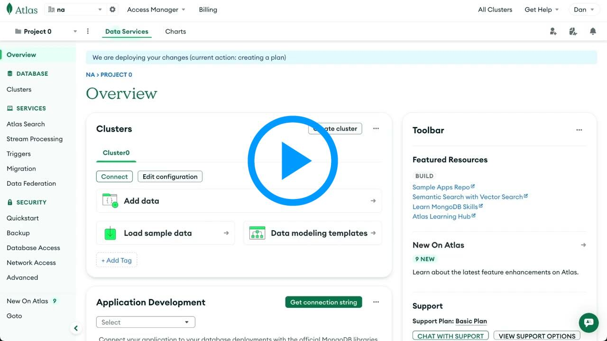
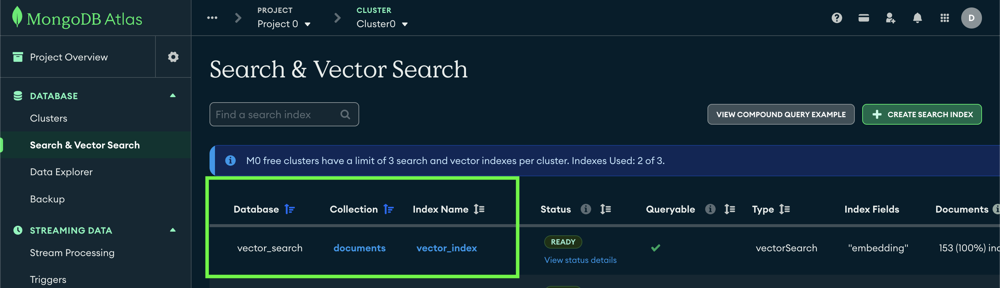

## MongoDB Atlas Setup

**Watch the MongoDB setup video walkthrough below:**

<p align="center">
  <a href="https://youtu.be/wv485CP37Mw"></a>
</p>

### Step 1: Create MongoDB Atlas Account and Cluster

If running Lab2 or Lab3, set up a free MongoDB Atlas account and cluster. First sign-up [here](https://www.mongodb.com/cloud/atlas/register).

<a id="step-1"></a>
#### 1. Create a **Project.**


<a id="step-2"></a>
#### 2. Create a **Cluster.**


<a id="step-3"></a>
#### 3. Choose the **Free Tier (M0).** Then choose your cloud provider (AWS or Azure) and region. Make sure this is the same region that your Confluent Cloud deployment is in. Click **Create Cluster.**


<a id="step-4"></a>
#### 4. **Create a Database User.** **Write down the username and password** you choose, as they will be `mongodb_username` and `mongodb_password` that you will need to deploy Terraform later. Click **Create Database User** when you are done

   **Note:** the username and password you set up to access your database are the credentials you'll need to save for later, NOT the separate login you use for mongodb.com.


<a id="step-5"></a>

#### 5. Click **Choose a Connection method.** => Shell => Copy the URL shown in **step 2.** This is the `MONGODB_CONNECTION_URL` you will need later. Don't worry about the rest of the command - you only need the URL that looks like `mongodb+srv://cluster0.xhgx1kr.mongodb.net/`

<a id="step-6"></a>

#### 6. Go to **Network Access** in left sidebar. Click green **Add IP Address** button on the right. Then simply click the **Allow Access From Anywhere** button, or manually enter `0.0.0.0/0`. Click **Confirm.**

> [!IMPORTANT]
>
>  ⚠️ **NOTE:** Important step! Confluent Cloud will not be able to connect to MongoDB without this rule. ⚠️

<details open>
<summary>Click to collapse</summary>


</details>

<a id="step-7"></a>

#### 7. Next, from Clusters page, choose "Atlas Search" then click "Add my own data." Enter "database name" and "collection name". Then, click Create Search Index, Choose Vector Search index and enter the "index name" below.

- Database name: `vector_search`
- Collection name: `documents`
- Vector search index name: `vector_index`




<a id="step-8"></a>

#### 8. Scroll down to the bottom and choose **JSON Editor.** Enter the following

   ```json
   {
     "fields": [
       {
         "type": "vector",
         "path": "embedding",
         "numDimensions": 1536,
         "similarity": "cosine"
       }
     ]
   }
   ```


## :white_check_mark: Checklist

- [ ] MongoDB cluster is in same region as your Confluent Cloud deployment ([step 3](#step-3))
- [ ] Database-specific user created, username and password saved ([step 4](#step-4))
- [ ] MongoDB connection string saved ([step 5](#step-5))
- [ ] IP address added to whitelist: `0.0.0.0/0` ([step 6](#step-6))
- [ ] Database name set as: `vector_search` ([step 7](#step-7))
- [ ] Collection name set as: `documents` ([step 7](#step-7))
- [ ] Atlas Vector Search index created and set as: `vector_index` ([step 7](#step-7))
- [ ] Atlas Vector Search index JSON configured as shown in ([step 8](#step-8))

## Navigation

- **← Back to Overview**: [Main README](../../README.md)
- **→ Lab2**: [Vector Search & RAG](../../LAB2-Walkthrough.md)
- **→ Lab3**: [Agentic Fleet Management](../../LAB3-Walkthrough.md)
- **→ Zapier Setup**: [Zapier Remote MCP Server Setup Guide](./Zapier-Setup.md)
